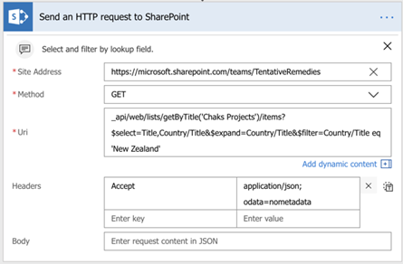

---

title: SharePoint connector improvements
description: There are two new SharePoint connector capabilities- trigger flows when items or files are deleted and call any HTTP endpoint the SharePoint REST API supports.
author: MargoC
manager: AnnBe
ms.date: 05/15/2018
ms.topic: article
ms.prod: 
ms.service: business-applications
ms.technology: 
ms.author: margoc
audience: Admin

---
#  SharePoint connector improvements

[!include[banner](../../includes/banner.md)]

As Flow is the successor to SharePoint Designer workflows, we continuously strive to improve our SharePoint connector capabilities. We've added two new capabilities:
- Triggers for when an item or file is deleted.
- An action to send an HTTP request to SharePoint.

The new action helps advanced users that are familiar with the SharePoint REST APIs to build queries and get results from SharePoint, especially if existing actions don’t currently support what you need or for scenarios where no action is available. For example, you can use this action to filter items using lookup fields or for controlling permissions to an individual item.

