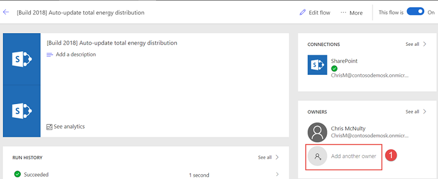
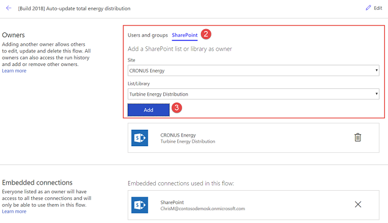
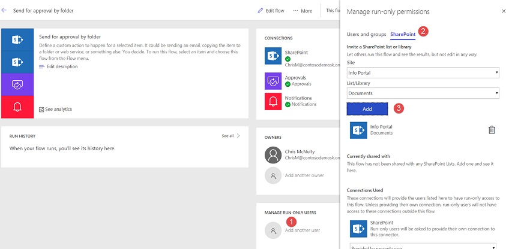

---

title: Flows owned by SharePoint lists and libraries
description: Flows that work with SharePoint lists and libraries can be shared with those lists, so instead of being shared with individuals or groups, they’re shared with everyone who has access to the list.
author: MargoC
manager: AnnBe
ms.date: 05/15/2018
ms.assetid: e3f9862c-b0e5-4b90-b74d-de6d794fa546
ms.topic: article
ms.prod: 
ms.service: business-applications
ms.technology: 
ms.author: margoc
audience: Admin

---
#  Flows “owned by” SharePoint lists and libraries

[!include[banner](../../includes/banner.md)]

Until recently, flows could be shared only with individuals or Azure Active Directory security groups. Now, flows that use SharePoint lists or libraries can be shared with those lists or libraries. This means that if new members are added to the list or removed, their access to the flow changes accordingly. Sharing comes in two flavors: you can add a list as a co-owner or as a run-only user. When you add a list as a co-owner, all members of the list have full access to the flow. They can edit the flow, delete it, or share it with others. When you add a list as a run-only user, all members of the list can only run the flow.

## Add a list as a co-owner

Let’s suppose you have a flow that runs when an item is created or modified in a SharePoint list – say *Turbine Energy Distribution*. This flow also does a Get item from another list called *Turbines*. You can add both lists as co-owners to the flow so that everyone who has edit access to the list automatically gets edit access to the flow. Once the flow has been shared, you can simply distribute a link to it.

To add the lists, select **Add another owner** on the flow and then the **SharePoint** tab in the Owners section. You should then be able to choose the Site and Lists/Libraries and select **Add**. You will see the List in the section below once you add it.

## Add a list as run-only user

Similarly, let’s suppose you have a flow that sends out a document for approval and it references the Documents library. From the Flow details screen, you can add the Site and corresponding Documents library as a run-only user.

Now all users that have read/write access to the Document library automatically have permissions to run the flow from the Flow menu in SharePoint.

