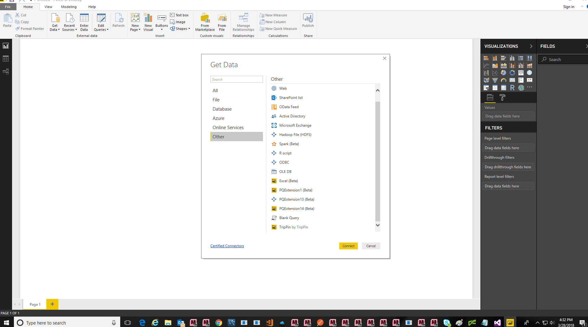

---

title: Certified Custom Connectors in Power BI Desktop
description: Certified Custom Connectors in Power BI Desktop
author: MargoC
manager: AnnBe
ms.date: 5/14/2018
ms.assetid: 9b679322-a91c-4566-903b-aa71ed227374
ms.topic: article
ms.prod: 
ms.service: business-applications
ms.technology: 
ms.author: margoc
audience: Admin

---
#  Certified Custom Connectors in Power BI Desktop

[!include[banner](../../../../includes/banner.md)]

>   In April, Microsoft released the first Custom Connectors in Power BI,
>   leveraging the powerful capabilities of the M language to allow partners to
>   write their own connectors and distribute them to every Power BI user. Now
>   any user can easily access connectors from all their data sources, and
>   vendors can easily write new connectors as their own customers demand,
>   improving Power BI’s role as the best BI platform for both vendors and end
>   users.

>   In May, this was brought in line with the existing Get Data experience,
>   making the experience seamless with existing, out of the box connectors, and
>   enabling the number of connectors available with a single click to increase
>   dramatically.

>   
<!-- L_31AC.tmp.PNG -->

