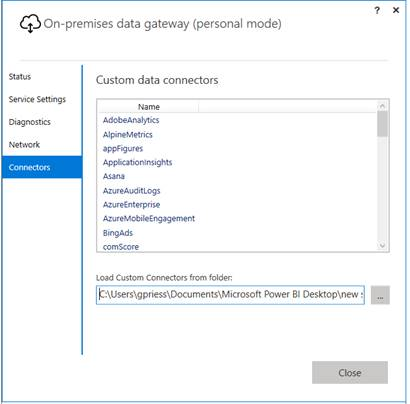

---

title: Custom Connectors support in on-premises data gateway
description: Custom Connectors support in on-premises data gateway
author: MargoC
manager: AnnBe
ms.date: 5/14/2018
ms.assetid: c46b0eb0-2ac5-4868-b397-8869a5863b9e
ms.topic: article
ms.prod: 
ms.service: business-applications
ms.technology: 
ms.author: margoc
audience: Admin

---
#  Custom Connectors support in on-premises data gateway

[!include[banner](../../../../includes/banner.md)]

>   As mentioned earlier in this document, in April, Microsoft released the
>   first Custom Connectors in Power BI, leveraging the powerful capabilities of
>   the M language to allow partners to write their own connectors and
>   distribute them to every Power BI user.

>   This semester we intend to extend the custom connectors support to the
>   on-premises data gateway as well. This will enable users of custom
>   connectors to have their reports built with custom connectors stay up to
>   date on the Power BI service by refreshing the data through the on-premises
>   data gateway.

>   
<!-- picture -->

