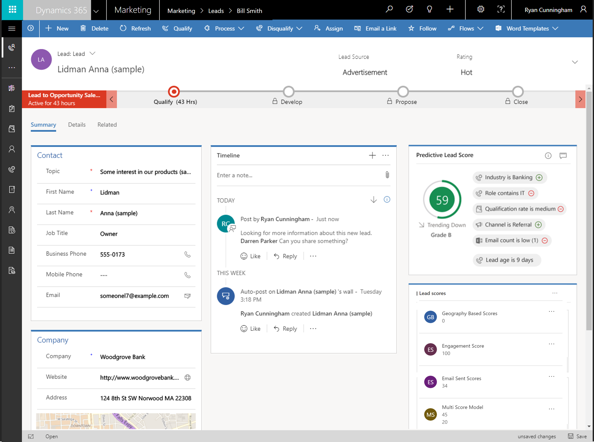

---

title: Marketing Insights App
description: [Description]
author: MargoC
manager: AnnBe
ms.date: 5/14/2018
ms.assetid: 99078f46-5757-4309-a43a-503e96f57c60
ms.topic: article
ms.prod: 
ms.service: business-applications
ms.technology: 
ms.author: margoc
audience: Admin

---
Marketing Insights App 
-----------------------

Marketing Insights collects, manages, and analyzes the diverse data and
communications created throughout marketing initiatives, and then automatically
suggests relevant actions and captures relevant activities to let marketers
target and run their campaigns more efficiently.

Marketing Insights app provides predictive lead scoring and other intelligent
insights to Dynamics 365 for Marketing users. Marketing Insights also enables
various advanced analytics scenarios and Power BI integration for Dynamics 365
for Marketing. In addition, Power BI also enables building custom dashboards and
reports for our users.

