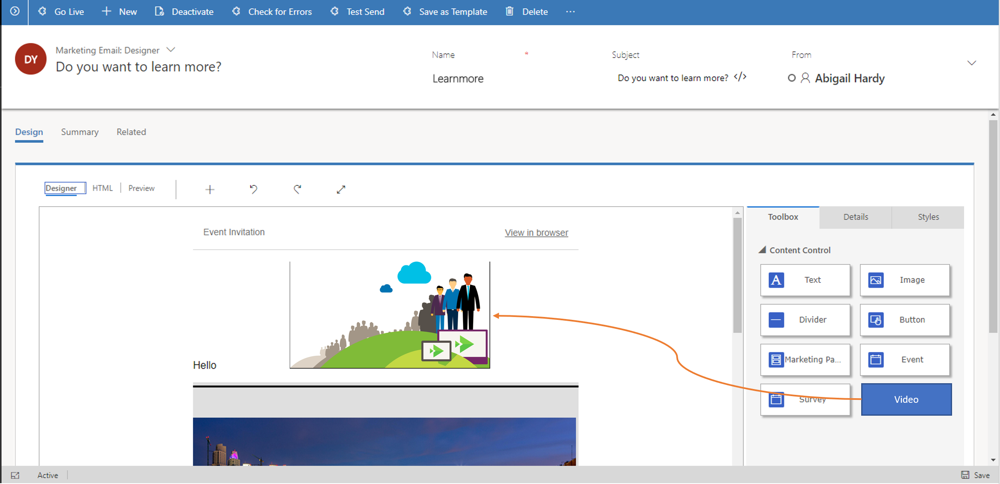

---

title: Video content using Microsoft Stream
description: [Description]
author: MargoC
manager: AnnBe
ms.date: 5/14/2018
ms.assetid: af5469b4-cc1e-45f6-8d47-f4d29353ef6d
ms.topic: article
ms.prod: 
ms.service: business-applications
ms.technology: 
ms.author: margoc
audience: Admin

---
Video content using Microsoft Stream
------------------------------------

Marketers can now embed videos into both emails or marketing pages. Clicking on
the content leads to a video player experience. The response to these videos can
be analyzed, scored, and segmented like any other marketing channel.

