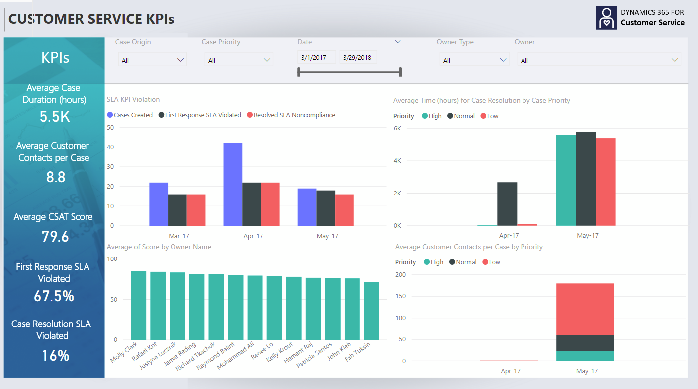
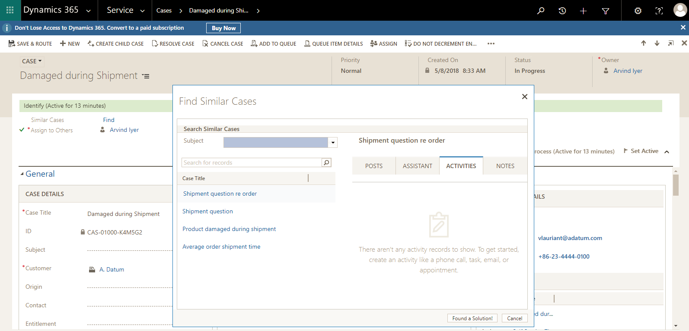
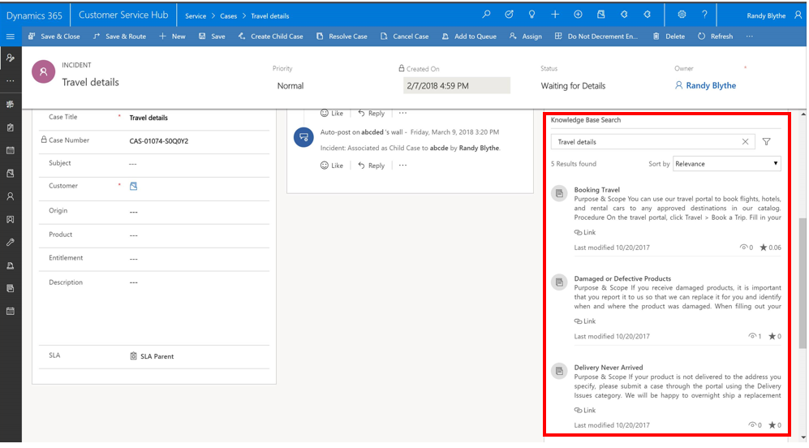

---

title: Insights
description: Customer Service Insights App provides necessary insights to CSMs to optimize customer service operations.
author: MargoC
manager: AnnBe
ms.date: 5/14/2018
ms.assetid: 597fc527-811e-4bbd-a1f8-511a9aba62ab
ms.topic: article
ms.prod: 
ms.service: business-applications
ms.technology: 
ms.author: margoc
audience: Admin

---
#  Insights

[!include[banner](../../../../includes/banner.md)]

Customer Service Insights App provides necessary insights to CSMs to optimize
customer service operations. Customer profile information empowers CSRs by
providing them insights on customer/product and helps them resolve issues
faster.

##### Customer Service Insights App

Customer Service Insights app is built atop CDS-A and provides insight into
Customer Service business process effectiveness to customer service managers
(CSMs). CSMs get insights through KPIs such as average handling time (AHT),
first call resolution (FCR) based on entity data in Dynamic 365. They can slice
and dice the KPIs through interactive dashboards based on customer service
entities and their attributes. CSMs will be able to define new KPIs based on
entity data in Customer Service App or other KPIs. Following are some of the
examples of KPIs that will be enabled in Insights App:

-   Customer related KPIs such as CSAT, NPS,

-   Case related KPIs such as first contact resolution (FCR), active cases,
    resolved cases

-   Overview of service center metrics such as average handling time (AHT),
    average wait time , average response time, traffic volume, trend

-   Service Levels such as, FCR, % SLAs met

-   Agent related KPIs such as AHT, capacity utilization, ratios of talk time,
    hold time, work time

CSMs can drill through interactive charts that indicate trends of all KPIs and
leverage prediction algorithms for values of the defined KPIs. The above
insights help CSMs in not only operating the service efficiently but also helps
them in identifying opportunities to minimize costs. Following screenshots
depict some of the example dashboards that provide insights on customer service
operations:

<!-- picture -->

<!-- picture -->

##### Suggest similar cases 

In current versions of Dynamics 365 Customer Service, as a customer service
representative handles a case, he is shown a list of recent cases from the same
customer. While this helps CSR in obtaining context on related cases of the same
customer, it does not help him in case of a fresh issue unrelated to previous
cases. This is the case even if there are other customers who have faced similar
issues. Microsoft [Text Analytics
APIs](https://azure.microsoft.com/en-in/services/cognitive-services/text-analytics/)
help provide intelligent insights on related cases to CSR based on case
information across different entity records. Following screenshot depicts CSR
experience:

This enables faster and better case resolution resulting in reduced average
handling time (AHT) and improved customer satisfaction. As a result, customer
service organization will be able to decrease their operating costs.

##### Knowledge article suggestion 

In current versions of Dynamics 365 for Customer Service, as a customer service
representative handles a case, a list of relevant knowledge articles based on
case title alone is shown. Microsoft [Text Analytics
APIs](https://azure.microsoft.com/en-in/services/cognitive-services/text-analytics/)
help provide knowledge article suggestions based on all related entities’ data.
This results in CSRs spending less time searching for answers and more time
providing the correct response. As a result, CSRs resolve cases quickly with
higher customer satisfaction. This helps service organizations in reducing
operating costs. The following screenshot depicts knowledge article suggestion
in Dynamics 365 for Customer Service:

<!-- picture -->

##### Customer profile

Organizations can improve customer satisfaction by resolving customer issues
faster and servicing them better by empowering their CSRs with latest
information about the customer conflated from multiple sources such as,
location, social posts, click-stream, app usage. Accurate and up-to-date
information about customers enables holistic and pro-active customer service.
Following widget depicts an example of Customer profile:

<!-- Picture 47 -->

