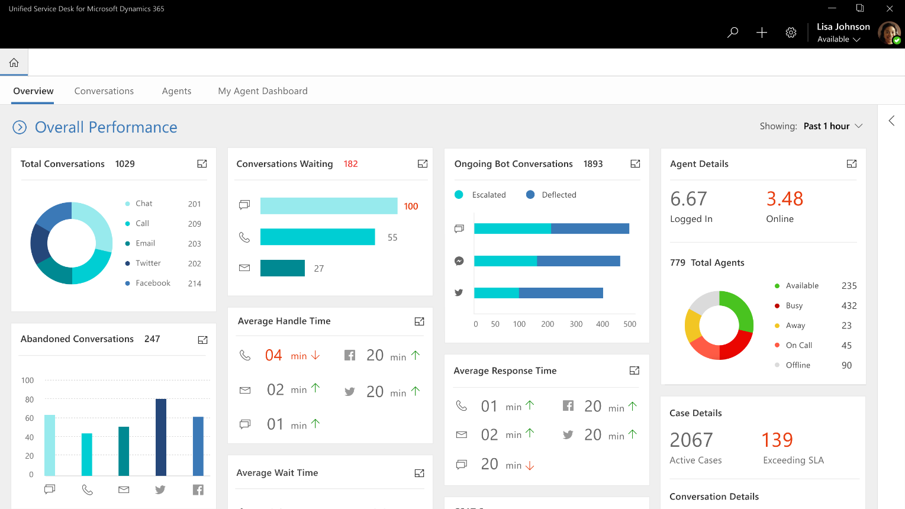

---

title: Agent and Supervisor Experiences
description: Agent and Supervisor Experiences
author: MargoC
manager: AnnBe
ms.date: 5/14/2018
ms.assetid: a370f401-fc3e-45b8-9366-0a59e0625c2b
ms.topic: article
ms.prod: 
ms.service: business-applications
ms.technology: 
ms.author: margoc
audience: Admin

---
#  Agent and Supervisor Experiences

[!include[banner](../../../includes/banner.md)]

**Agent Experiences**

Agents are able to serve customers across all channels from the same,
easy-to-learn interface. By providing a consistent experience, Service
organizations are able maximize agent productivity as well as reduce training
needs. By providing the ability for agents to handle multiple sessions
simultaneously while preserving customer context, agents are able to resolve
issues faster and meet the average handling time (AHT) goals of the
organization.

<!-- Picture 2 -->

<!-- picture -->

Key capabilities for Agent Experiences include:

-   Rich multi-session experiences for enhanced agent productivity delivered
    using Unified Service Desk

-   Contextual 360 degree view of Customer

    -   Past interactions

    -   Customer Profile

-   Contextual view of the current issue

    -   Customer Journey

-   Presence control for efficiently managing work distribution

-   Screen-pops and notifications

**Supervisor Experiences**

*\< The supervisor experiences will be built on UCI and Power BI embed , these
experiences will then be hosted inside USD \>*

To manage the agent workforce, organizations require real-time monitoring
capabilities to manage the volumes of customer requests that are handled every
day.

<!-- picture -->

<!-- picture -->

The supervisor application will provide the following key experiences:

-   Unified views for different roles within the service operations organization

    -   Experiences for team managers

    -   Views for Operations Managers

    -   Overall Business indicators dashboards

-   Real-time health tracking

    -   Monitoring of key performance indicators like Customer Satisfaction,
        Service Levels, etc.

    -   Tracking of Efficiency parameters like Conversations Handled, Average
        Handling Times, etc.

-   Real-time conversation monitoring

    -   Capabilities for Supervisors to help agents resolve tricky issues
        through Whisper capability

    -   Monitoring of long running conversations through Monitor, Barge
        capabilities

-   Historical reports via CDS-A

    -   Analysis of operations over a longer period for performance measurement
        of agent workforce

    -   Analysis of historical data for process improvements
