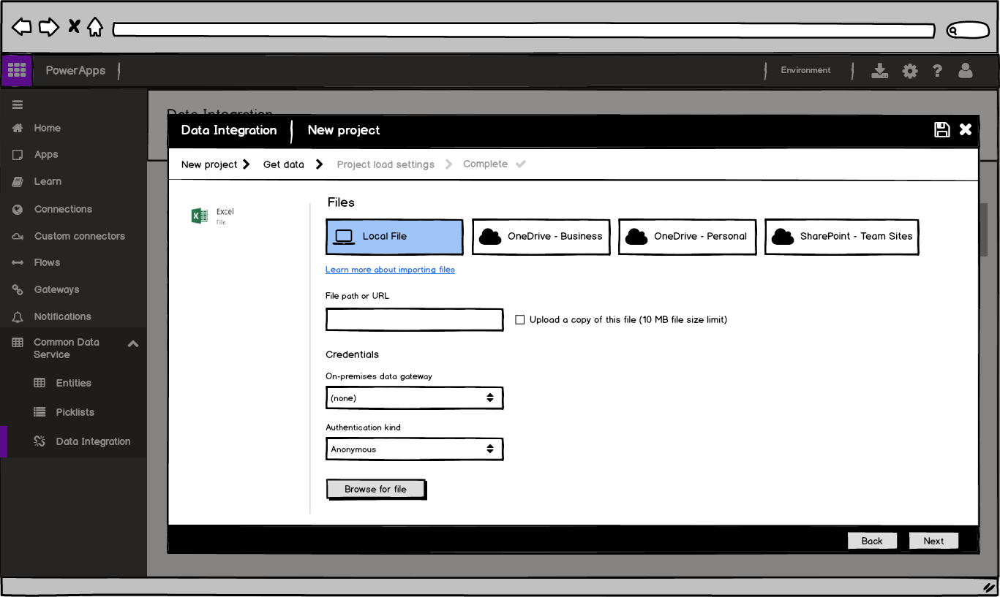

---

title: Improved connectors and import experiences for CDS Data Integration
description: Improved connectors and import experiences for CDS Data Integration
author: MargoC
manager: AnnBe
ms.date: 5/14/2018
ms.assetid: b0e64ebd-9c00-4bc5-9b02-abd2a0b35029
ms.topic: article
ms.prod: 
ms.service: business-applications
ms.technology: 
ms.author: margoc
audience: Admin

---
#  Improved connectors and import experiences for CDS Data Integration 

[!include[banner](../../../../includes/banner.md)]

>   Earlier this year in April, Microsoft unveiled a Public Preview of the
>   Common Data Service for Applications and for Analytics. As part of this
>   Preview, there were built-in capabilities for business users to import data
>   from a wide range of data sources from Microsoft and 3rd parties in the
>   cloud and on-premises, leveraging a web-based no-code/low-code Power Query
>   experiences that users are already familiar with from Excel and Power BI
>   Desktop.

>   In the past six months, Microsoft has continued expanding support for data
>   connectors and data transformations in this web-based Power Query
>   experience, including support for business-critical data sources
>   (on-premises and cloud), such as Oracle, Amazon Redshift, Google BigQuery,
>   Impala, and others.

>   Microsoft has also added support for custom connectors (based on the Data
>   Connector SDK) in Power Query Online, so existing custom connectors built by
>   ISVs can now also be leveraged for data integration with the Common Data
>   Services for Applications, and for Analytics.

>   The user experience for importing data from files into CDS has also been
>   improved, by allowing users to upload local files which is a common request.

>   
<!-- Get Data 5.png -->

>   Likewise, Microsoft has enabled browsing for files in popular Cloud-based
>   file storage services, such as OneDrive Business/Personal and SharePoint
>   Team Sites. Users can also now easily combine multiple files in a folder
>   from any of these locations, which was a very popular request from Preview
>   customers.
