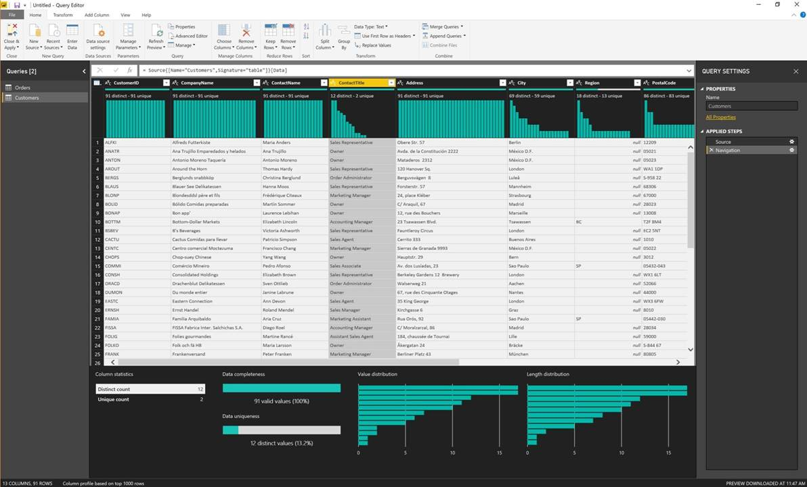
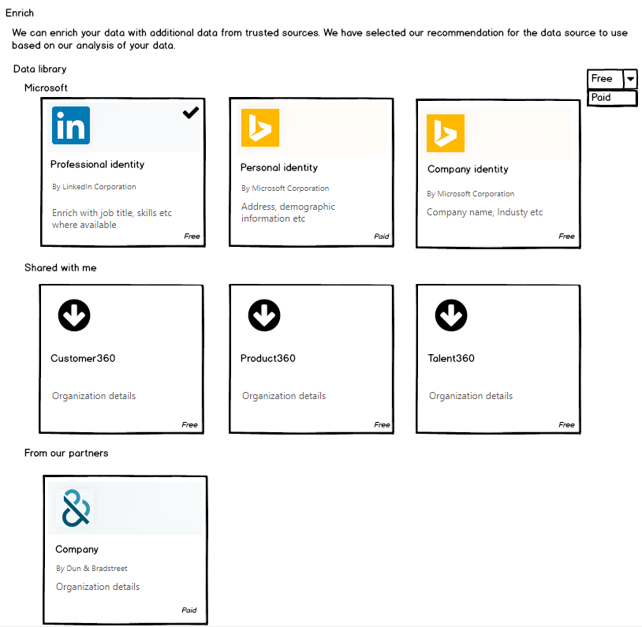

---

title: Power Query becomes more powerful and smarter
description: Power Query becomes more powerful and smarter
author: MargoC
manager: AnnBe
ms.date: 5/14/2018
ms.assetid: e2441a5c-b208-4c88-9f3a-ae900ca03e84
ms.topic: article
ms.prod: 
ms.service: business-applications
ms.technology: 
ms.author: margoc
audience: Admin

---
#  Power Query becomes more powerful and smarter

[!include[banner](../../../../includes/banner.md)]

##### Smart Data Preparation

>   Power Query has been dramatically enhanced with market-leading *Smart Data
>   Preparation* experiences, including the ability to

-   extract data from semi-structured sources like PDF files

-   HTML pages,

-   fuzzy matching algorithms to rationalize and normalize data based on
    similarity patterns and

-   data profiling capabilities

>   to easily identify errors and outliers as part of the Data Preparation
>   workload in the Power Query Editor.

>   
<!-- picture -->

>   Microsoft is leveraging its leadership in the Artificial Intelligence field,
>   based on years of investment in several projects within Microsoft Research,
>   and surfacing these Smart Data Preparation capabilities in Power Query,
>   making them easily accessible to millions of business users across different
>   Microsoft products and services (Excel, Power BI, CDS for Apps, CDS for
>   Analytics, and Microsoft Flow).

#####  Query Profiling

>   In addition to Smart Data Preparation enhancements, Power Query also
>   includes now built-in capabilities and user experiences around Query
>   Profiling, allowing users to easily understand the execution profile of
>   their queries and self-diagnose issues – what queries were run and why, how
>   long it takes to get data from external sources, what
>   queries/transformations didn't get pushed down to underlying sources, and
>   more.

>   
<!-- picture -->

##### Intelligent transforms and AI support in Power Query 

>   Business Analysts can easily incorporate AI driven insights with a
>   single-click access to AI-based transforms. Initial capabilities in this
>   area include sentiment analysis and keyword extraction from natural language
>   text. Additional capabilities, such as OCR and image analysis could be added
>   over time.

>   Analysts and BI Pros will gain access to new out-of-the-box functions and
>   APIs for AI transformations. This facilitates column transformations for
>   sentiment analysis and keyword extraction with a click of a button, or with
>   a single line of script, such as “ApplySentimentIndex([textResponse])”.

>   The Power Query APIs will also be supported in Power BI Insights
>   applications, for use during installation and configuration of Power BI
>   applications making use of datapools. In this instance, batch-processing of
>   the transforms for the column will be directed seamlessly to a Cognitive
>   Services container running as part of a customer’s Power BI Premium
>   capacity.

##### Analytic and ML extensibility with scripting

>   We currently support the use of R scripts for custom modeling and
>   visualization in Power BI. These R scripts can also be executed as part of
>   data refresh in the Power BI Service leveraging the On-premises Data Gateway
>   (personal mode) with the option to plug-in custom R libraries.

>   Python has gained widespread adoption among developers and data scientists.
>   It is the de-facto standard for data analysis and AI related work due to its
>   large support for useful libraries. As the next step, Power BI Desktop is
>   adding support for Python scripting.

##### Power Query support for data enrichment (Profile 360°)

>   With Power Query, organizations can now enrich customer profile data in CDS
>   by data integration. For example, Bing Audience Intelligence helps enrich
>   customer profiles with interests, purchase intent, and demographics. Below
>   are some example mockups.

>   
<!-- picture -->

##### Intellisense support for the M formula language

>   Intellisense support for the M language editing experiences (Advanced Query
>   Editor, Add Custom Column and Formula Bar) has been added to the Power Query
>   Editor, making users more successful in editing their M code directly, being
>   able to easily find errors, discover M library functions and understand what
>   parameters are needed, etc. M Intellisense support was the most requested
>   feature from intermediate-to-advanced Power Query users in the last couple
>   of years and was at the top of the feature asks for Power Query in the Power
>   BI & Excel Feature Suggestions forums.

>   
<!-- picture -->

>   In addition to new core capabilities within Power Query, Microsoft has also
>   extended the range of products and services that leverage Power Query. Over
>   the past six months, Power Query Online has been integrated to Microsoft
>   Flow and Azure Data Factory.

##### Flow support for data filtering & mashup

>   Microsoft Flow now allows users to “Get Rows using Power Query” which
>   enables data filtering & mashup as part of the “Get Rows” action on specific
>   connectors, such as SQL Server.

##### Azure Data Factory integration with Power Query Online 

>   Azure Data Factory (ADF) integration with Power Query Online allows ETL
>   developers to leverage Power Query Online’s data connectors & data
>   transformations to define Data Flows as part of their ADF projects.

>    
<!-- picture -->

##### Power Query Community Website

>   Last but certainly not least, a new Power Query Community Website was
>   launched recently, which includes Power Query technology overview and deep
>   dive articles, as well as forums, UserVoice and community-driven content
>   (blog posts, webinars, etc.). This new community focuses on the core Power
>   Query technology aspects that enables ISVs to build new connectors and data
>   transformations on top of the platform, and complements the previously
>   existing product-based resources (Excel, Power BI, PowerApps, etc.) which
>   cover specific Power Query integrations from an end-user perspective.
