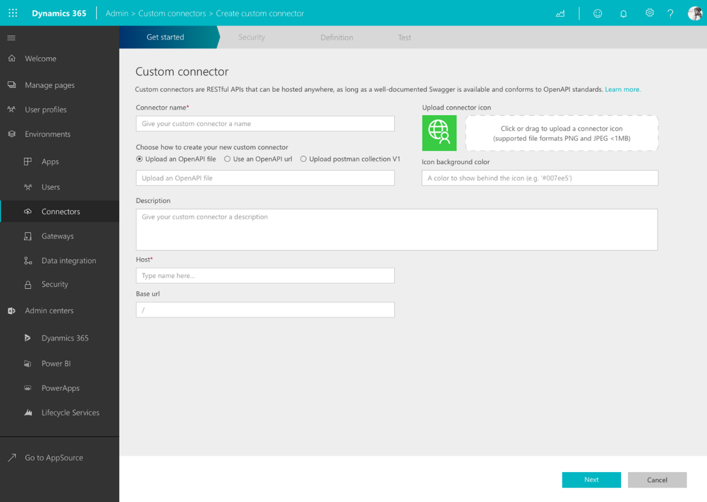
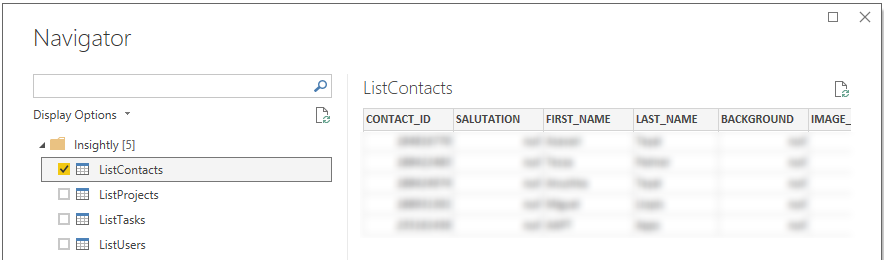

---

title: 3. Richer and more unified connector   developer ecosystem
description: 3. Richer and more unified connector   developer ecosystem
author: MargoC
manager: AnnBe
ms.date: 5/14/2018
ms.assetid: 64dd4753-dced-47af-8087-0a75f48a4a2d
ms.topic: article
ms.prod: 
ms.service: business-applications
ms.technology: 
ms.author: margoc
audience: Admin

---
#  3. Richer and more unified connector & developer ecosystem

[!include[banner](../../../includes/banner.md)]

>   A critical part of Data Integration, and the suite of products it supports,
>   is connectivity to external data sources. While we continue to invest in a
>   set enterprise grade data sources, there are a growing number of databases
>   and services many users come to depend out outside of that set. To ensure
>   our users can connect to the data they need, we continue to invest in our
>   extensibility points throughout the platform.

>   Until recently, developers and ISVs looking to build connectors for our
>   platform had to choose between building connectors with actions & triggers
>   for PowerApps, Flow and Logic Apps, or building rich data connectors for
>   Power BI. In addition, connectivity for the Common Data Service (for Apps or
>   Analytics) through Data Integration was limited to built-in connectors. ISVs
>   interested in supporting our full platform were limited in the products they
>   could release to and had to commit to a large investment of building
>   multiple connectors.

>   Today’s release includes a wide variety of improvements for ISVs and
>   developers to build, test and release their connector across Power BI,
>   PowerApps, Flow, Logic Apps and CDS. Now a single connector that works
>   across the full platform can be developed from scratch or created from an
>   existing OpenAPI or OData definition.

>   
<!-- Picture 2 -->

>   Developers interested in building such a connector can get started with the
>   connector portal and SDK that is now available. It allows developers to
>   bring their existing definitions or start from scratch and will generate the
>   correct artifacts for the full platform. In addition to inline testing
>   experiences, the connector can be automatically deployed to Flow, PowerApps
>   and Logic Apps or downloaded to use with the Power BI Desktop or On-premises
>   Data Gateway.

>   
<!-- picture -->

>   In addition, we’re working with the Office Store to offer improved
>   submission and consumption experiences for connectors across the platform.
>   This integration will add connectors to the large number of integrations
>   available through the Office Store and improve experiences for our
>   developers and consumers in the ecosystem.

>   The connector certification program is open to submissions for any
>   partner-built connectors that meet the basic requirements: 1) the submitter
>   is affiliated with the service the connector is built against and 2) the
>   connector supports business user scenarios that make sense within the
>   PowerApps, Flow, Logic Apps, Power BI and CDS ecosystem.

>   While most connectors for PowerApps, Flow and Logic Apps will continue to be
>   of the simple action/trigger-oriented API Connector variety (Microsoft is
>   targeting 1000s of connectors in this mix), the latest platform enhancements
>   are a welcome capability for anyone looking to integrate deeply across the
>   app platform.
