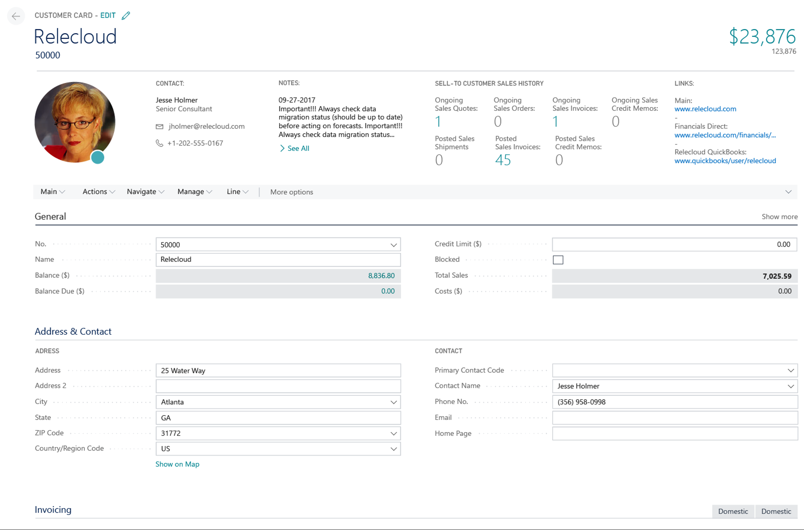

---

title: Completed visual refresh
description: The visual refresh extended to card pages.
author: edupont04
manager: AnnBe
ms.date: 5/22/2018
ms.assetid: 8ac65713-42af-4fcf-a3c0-eb8c6abc4aab
ms.topic: article
ms.prod:
ms.service: business-applications
ms.technology:
ms.author: edupont
audience: Admin

---
#  Completed user experience visual refresh across all page types

[!include[banner](../../includes/banner.md)]

In the April 2018 release, Business Central received a new and refreshed user experience. While the refresh was across many major parts of the application, there were some areas that were left untouched. With the October 2018 update, the user experience refresh is complete across the entire application. All pages, including card pages (such as the Customer card) have been updated with a new refreshed and appropriately reimagined user experience. The new user experience now brings its benefits of increased screen estate, better data visibility and easier navigation to the entire application.

