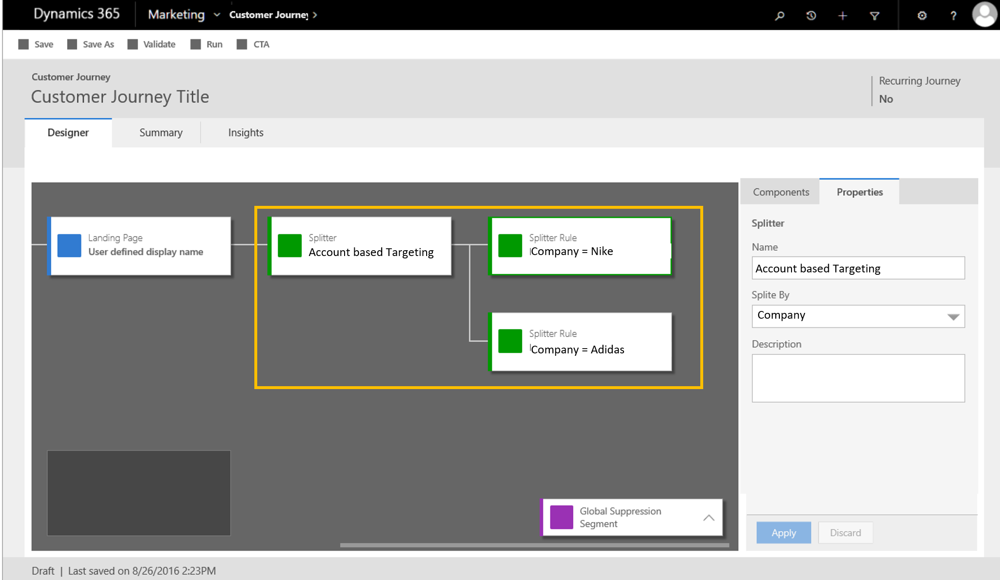

---

title: Account Based Marketing
description: B2B marketers using Dynamics 365 for Marketing can communicate with their key business accounts as units of one, enabling an increased integration and alignment between the sales and marketing departments in the organization and focusing on the most important accounts.
author: MargoC
manager: AnnBe
ms.date: 5/14/2018
ms.assetid: 479435f8-ed52-4371-b0ea-9be3b4c9ab9a
ms.topic: article
ms.prod: 
ms.service: business-applications
ms.technology: 
ms.author: margoc
audience: Admin

---
#  Account Based Marketing

[!include[banner](../../../includes/banner.md)]

B2B marketers using Dynamics 365 for Marketing can communicate with their key
business accounts as units of one, enabling an increased integration and
alignment between the sales and marketing departments in the organization and
focusing on the most important accounts. Using Dynamics 365 for Marketing in
Account Based Marketing scenarios enables sales and marketing to close more
deals targeting specific accounts, those that are most likely to generate the
largest revenue.

