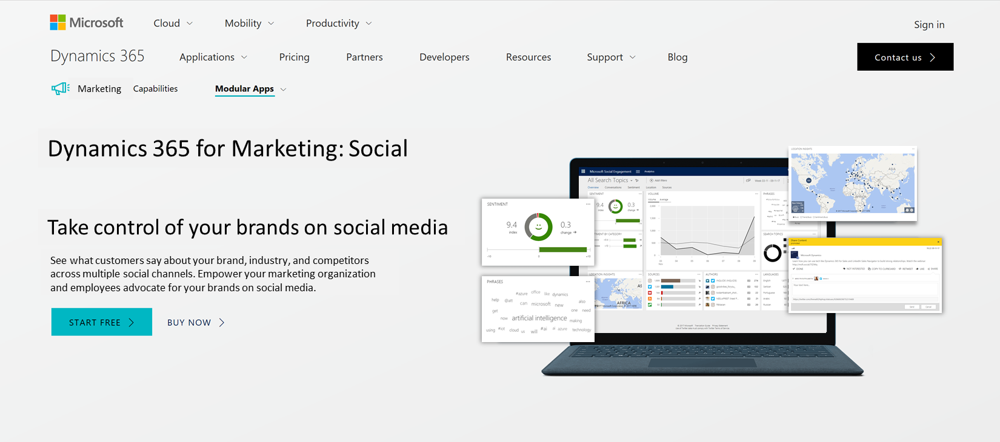

---

title: New app for Brand Monitoring
description: Social media has become an intrinsic part of the Brand Management function of every successful marketing organization.
author: MargoC
manager: AnnBe
ms.date: 5/14/2018
ms.assetid: 91cd6fc6-df55-4db6-9541-207b8548a22c
ms.topic: article
ms.prod: 
ms.service: business-applications
ms.technology: 
ms.author: margoc
audience: Admin

---
#  New app for Brand Monitoring

[!include[banner](../../../includes/banner.md)]

Social media has become an intrinsic part of the Brand Management function of
every successful marketing organization. Monitoring, measuring, and managing how
a brand is perceived on the social media is critical to the success of that
brand.

Our new app for Brand Monitoring will empower your marketing organization to
take better control of your brand on social media. Accessing and getting started
will be quick and easy with:

-   **Self-service experience**: Whether you want to give the app a try or buy
    it, a simple sign-up experience directly from our public website gives you a
    frictionless self-service experience to get started within minutes.

-   **Quick setup**: The simple first-run experience guides you to setup search
    topics for your brand with just a few clicks.

-   **Instant insights**: Historical data is acquired and loaded for your brands
    right after the quick setup, giving you instant insights for your brand from
    social media. You can then immediately start exploring with our interactive
    analytics.

<!-- Picture 3 -->

Our brand monitoring app comes with several powerful features such as:

-   Our unique **adaptive sentiment** and **intention analysis** capabilities
    that enable you to quickly identify the most important conversations.

-   **Intelligent alerts** enable you stay ahead of any potential PR crisis via
    notifications whenever significant changes on social media are detected.

-   Ability to grow and engage your social media communities by easily
    identifying, tracking, and connecting with brand **influencers** and
    industry experts.

-   Empowering your marketing organization employees to advocate for your brand
    by providing them **intelligent** and **personalized recommendations** that
    they can **share** on their social networks.
