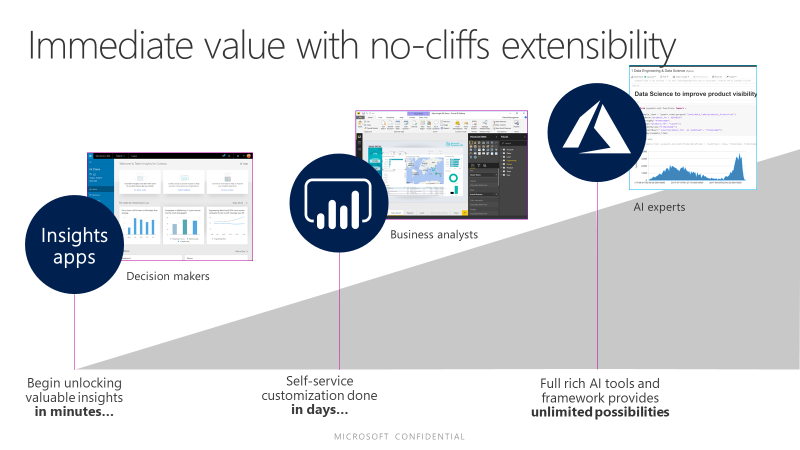

---

title: Overview
description: The Common Data Service for Analytics continues to reduce the time, complexity, and cost of developing business analytics from data spanning multiple business applications and data sources.
author: MargoC
manager: AnnBe
ms.date: 5/14/2018
ms.assetid: 7cbe26af-1987-413f-b521-e273fe5e2be5
ms.topic: article
ms.prod: 
ms.service: business-applications
ms.technology: 
ms.author: margoc
audience: Admin

---
#  Overview

[!include[banner](../../../includes/banner.md)]

The Common Data Service for Analytics continues to reduce the time, complexity,
and cost of developing business analytics from data spanning multiple business
applications and data sources. It does this by simplifying and automating the
ingestion, transformation, integration, and enrichment of standard business
application entities, and making those business entities available to business
users through Power BI and Power BI enabled solutions. As the Common Data
Service for Analytics evolves, additional applications, published by both
Microsoft and Microsoft partners, are becoming available. This Fall, these
include, among others, Marketing Insights, Sales Insights, Service Insights,
Operations Insights, Finance Insights, and Talent Insights.

This Fall, the Common Data Service for Analytics brings new value in three
areas:

-   **For Decision makers**: Microsoft has published new **insight apps** for
    Sales, Service, Marketing, Operations, Finance, and Talent. These
    applications bring data into the Common Data Service for Analytics in the
    standard schema and are enriched with Microsoft data daily, for business
    users and decision makers. New Insight Apps are regularly being published by
    ISVs and partners as well.

-   **For Business Analysts**: the Common Data Service for Analytics allows
    easy, self-service access to customize the ingestion, transformation and
    enrichment of business entities with a no code/low code experience.

-   **For Developers and Data Scientists**: the Common Data Service for
    Analytics allows them to leverage the depth of Azure by easily connecting
    data in the Common Data Service for Analytics to Azure services, such as
    Azure Machine Learning, Azure Databricks, and Azure Data Factory.

>   
<!-- picture -->

