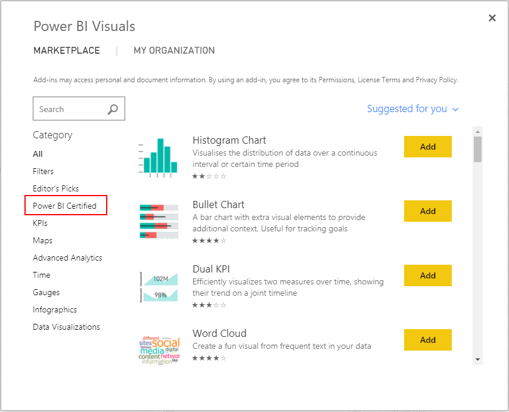

---

title: Certified custom visuals in the marketplace
description: Developers of custom visuals in the marketplace can choose to go through an additional certification process for enhanced security and quality, to get a certification from the Power BI team, which will enable the visual to be supported in export to PowerPoint and email subscriptions.
author: MargoC
manager: AnnBe
ms.date: 5/14/2018
ms.assetid: f1946113-70d6-4318-9b1a-29a02956dab9
ms.topic: article
ms.prod: 
ms.service: business-applications
ms.technology: 
ms.author: margoc
audience: Admin

---
#  Certified custom visuals in the marketplace

[!include[banner](../../../../includes/banner.md)]

Developers of custom visuals in the marketplace can choose to go through an
additional certification process for enhanced security and quality, to get a
certification from the Power BI team, which will enable the visual to be
supported in export to PowerPoint and email subscriptions. In addition, the
certification provides reassurance to users that the visuals are safe to use
with their data.

Certified custom visuals are now clearly discoverable in the marketplace, by
filtering with the “Power BI Certified” category, and with a visual mark on the
marketplace listing, both in AppSource and in the integrated UI.

<!-- picture -->
 IMAGELINKSTART media/image11.png
IMAGELINKEND
