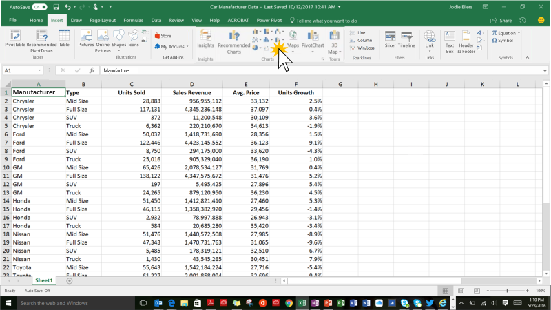
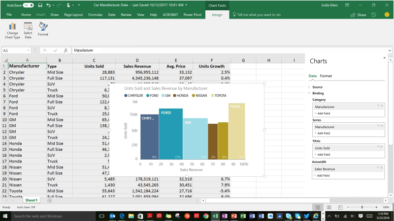

---

title: Custom visuals in Excel  Preview 
description: Custom visuals in Excel  Preview 
author: MargoC
manager: AnnBe
ms.date: 5/14/2018
ms.assetid: 5f6bb229-f5ef-4b6e-8e1d-a329ecdd23ed
ms.topic: article
ms.prod: 
ms.service: business-applications
ms.technology: 
ms.author: margoc
audience: Admin

---
#  Custom visuals in Excel (Preview)

[!include[banner](../../../../includes/banner.md)]

Custom visuals are the standard mechanism for custom third-party visualizations
integrated into Excel’s charting experience in Office and Power BI. Custom
visuals you build for Power BI also work in Office. Developers can submit a
single custom visual which will be available for both Power BI and Excel in each
of the dedicated stores, as well as in AppSource. Excel users can discover and
import custom visuals from the Excel store into their Excel sheet, on top of the
sheet data.

 IMAGELINKSTART media/image8.png
IMAGELINKEND 
