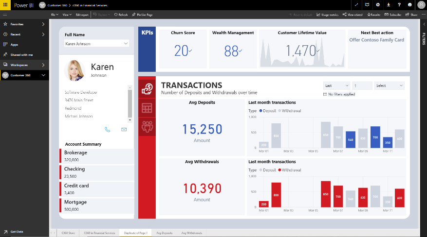

---

title: Customer 360  App
description: Customers, both existing and potential, leave digital footprints.
author: MargoC
manager: AnnBe
ms.date: 5/14/2018
ms.assetid: 57739c67-ce55-4c6c-b55c-b4c036bda168
ms.topic: article
ms.prod: 
ms.service: business-applications
ms.technology: 
ms.author: margoc
audience: Admin

---
#  Customer 360° App

[!include[banner](../../../includes/banner.md)]

Customers, both existing and potential, leave digital footprints. Every web
search, tweet, support call, event registration, purchase, or interaction with a
connected product or digitally-intermediated service provides clues to the
intent, interests, and demographics of that person. Customer journey management
requires the unification of data across marketing, sales, service, and
operations. Power BI now provides a highly flexible Customer 360° Power BI app
which can be easily adapted to provide relevant insights to specific customer
facing roles like service agents, campaign managers, or sales professionals. By
applying the new Profile 360° capabilities to the domain of customer engagement,
Power BI Customer 360° reduces the time to implement “single view of the
customer” programs by orders of magnitude.

The Customer 360° application includes the following core capabilities:

| 
<!-- picture -->
 | the ability to fully understand the customer journey across channels by using contextual information and artificial intelligence to match known customers with the activities and profiles of previously unknown customers. |
|----------------------------------------------|-----------------------------------------------------------------------------------------------------------------------------------------------------------------------------------------------------------------------------|

-   the ability for business users to define key customer related measures and
    KPI’s (e.g. engagement score, customer lifetime value, net promoter score,
    customer satisfaction) and then see the complete customer journey updated in
    near-real time, with all related KPI’s, as new data arrives.

Customer 360 enables business end users to discover and test drive the
application in under 5 minutes. Furthermore, Power BI provides an easy wizard
like experience to adapt the out-of-the box data visualizations, metrics and
predictive analytics results to a specific business model or industry.
