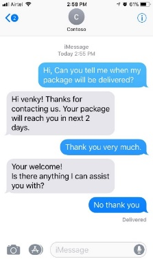
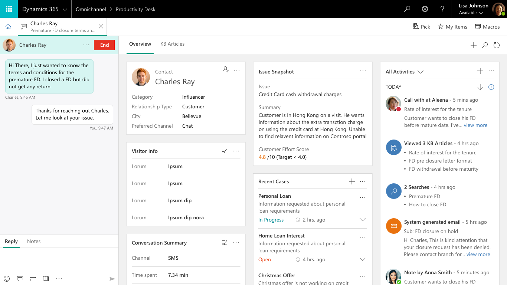

---

title: SMS Channel for Omnichannel
description: SMS Channel for Omnichannel
author: MargoC
manager: AnnBe
ms.date: 5/14/2018
ms.assetid: 303fa52e-5884-40cd-acc2-72d0512b0e39
ms.topic: article
ms.prod: 
ms.service: business-applications
ms.technology: 
ms.author: margoc
audience: Admin

---
#  SMS Channel for Omnichannel

[!include[banner](../../../includes/banner.md)]

*This is a P0 ask from Department of Veteran Affairs for the Omni Channel
feature work*

In any given day, more than 80 billion messages are exchanged between friends,
family and businesses via messaging. SMS channel provides ability for the
organization to reach and interact with their customers in a timely and
convenient manner.

*Use Cases*

-   *2- way texting capability - Inbound Messaging (Customer Initiated)*

    -   Scenario: Product enquiry, Installation query, Support Issue etc.,

    -   Message sent by the customer is routed to available agent and 2-way
        conversation is initiated between Agent and customer (Sync Channel).
        When the agent is not available, the message is routed to queue and
        agent replies when available (Async Channel)

-   *2- way texting capability -Outbound Messaging (Agent initiated)*

    -   Scenario: Agent reaching out to customers for scheduling appointment,
        plan update etc.,

-   *Automated SMS notification from system*

    -   Scenario: Notifications sent to the customer during case creation, case
        resolution, appointment reminder etc.,

**Key Capabilities of SMS Channel**

-   2-way texting capability initiated by agents or by customers

-   Automated SMS notification from Omnichannel system

-   Capability of SMS channel as sync. & async.

-   Automated response management

*
<!--  -->
IMAGELINKSTART media/image15.png
IMAGELINKEND
<!--  -->
Customer Experience:*

*Agent Experience:*

<!-- picture -->

