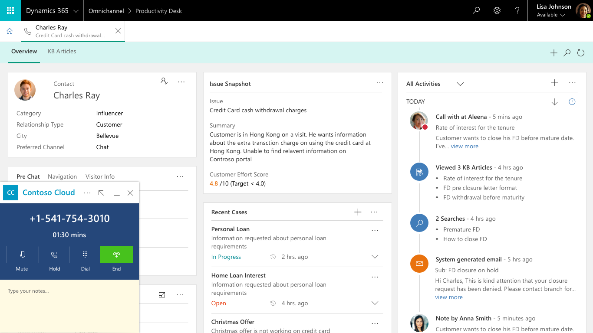

---

title: Web CTI Integration Framework
description: Web CTI Integration Framework
author: MargoC
manager: AnnBe
ms.date: 5/14/2018
ms.assetid: fbf6b3a6-d7f4-4315-ae47-ce53eb2cdea4
ms.topic: article
ms.prod: 
ms.service: business-applications
ms.technology: 
ms.author: margoc
audience: Admin

---
#  Web CTI Integration Framework

[!include[banner](../../../includes/banner.md)]

*This is a P0 ask from Department of Veteran Affairs for the Omni Channel
feature work*

*This is also a P0 ask for customers like HP, Maxim*

*This is also blocking several partners like Five9, Ingenius, Avtex, Genesys,
Bucher-Suter, etc.*

*UCI Dependency -*
[846493](https://dynamicscrm.visualstudio.com/DefaultCollection/OneCRM/_workitems/edit/846493)
- *Immersive 3rd Web CTI experience - omnichannel in customer service (to host
ISV widgets in CRM UCI shell)*

CTI ISVs like Avaya, Cisco, Genesys, Five9, etc. would like to embed their
channel solutions into the Web based agent experiences of CRM systems so that
agents get an embedded immersive experience as they interact with Customer
profiles and Case processes. At this time, these ISVs are only able to integrate
with our rich client USD agent application due to lack of a SDK framework , this
in turn results in low CSAT as customers are forced to deploy and maintain
desktop USD application , UDS only works with Internet explorer browser and
therefore has severe performance and reliability constraints. To remedy this, we
want to provide a JavaScript library for the partners to perform seamless
channel integrations and build immersive experiences for the users of Dynamics
365, including key scenarios of Screen Pop and Click to dial/chat.

<!-- picture -->

Below is the set of capabilities to be enabled.

*Embed cloud telephony UI inside Customer Service Web applications*

-   Partners can **embed their communication widget** in the Dynamics 365
    layout, which can communicate with Dynamics 365 using a standard API set. On
    the embedded widget, partners can perform operations to minimize, maximize,
    resize and define other interaction experiences within the Dynamics 365
    layout.

*Enable two-way data exchange between Partner solution and Dynamics 365*

-   For an incoming request like a Phone Call or a Chat Message, partner
    solution can send the customer information to Dynamics 365, so that
    appropriate contact and account forms can be opened

-   After the call or chat is completed, Partner solution should be able to send
    the data to Dynamics 365 so that appropriate activities can be stored in our
    database

-   Partners can use the omnichannel **analytical capabilities** to generate
    KPIs for their channels
