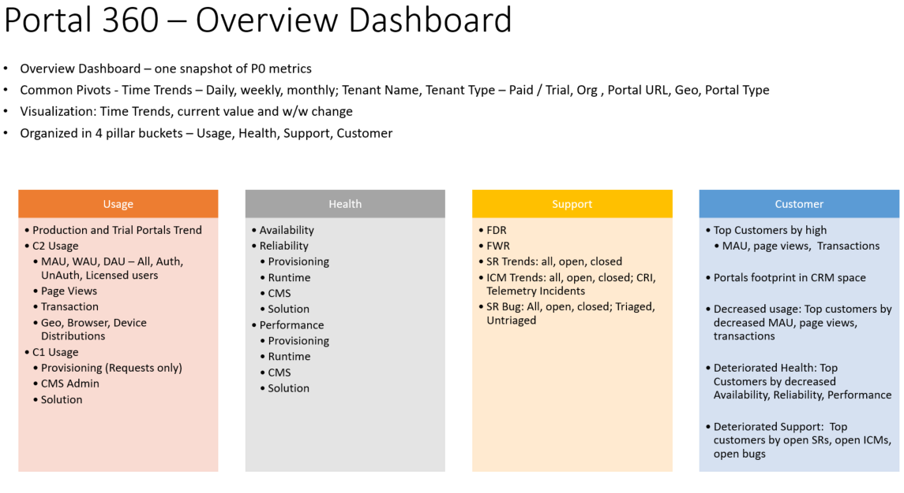

---

title: Telemetry Investments  Ready for review
description: In alignment with the BAG goals of quality, quality and telemetry, portals will be focusing on improving its telemetry and reporting around 3 key pillars - usage, health and support in order to provide great customer experience in turn leading to improved adoption of portals, improved CSAT and data driven decisions for future feature, engineering, and support investments.
author: MargoC
manager: AnnBe
ms.date: 5/14/2018
ms.assetid: 31b00bc7-1234-4ab7-a559-198ee8305e48
ms.topic: article
ms.prod: 
ms.service: business-applications
ms.technology: 
ms.author: margoc
audience: Admin

---
#  Telemetry Investments: Ready for review

[!include[banner](../../../includes/banner.md)]

In alignment with the BAG goals of quality, quality and telemetry, portals will
be focusing on improving its telemetry and reporting around 3 key pillars -
usage, health and support in order to provide great customer experience in turn
leading to improved adoption of portals, improved CSAT and data driven decisions
for future feature, engineering, and support investments.

In this release, we will have the following:

1.  *[Internal]Scenario based Telemetry:* Capture Availability, Reliability,
    Performance of P0 Scenario \> Sub Scenario \> Measure metrics to roll up in
    the overall Bedrock reporting, this involves identifying and addressing gaps
    in the existing telemetry instrumentation, sending telemetry data to the
    bedrock systems for reporting

2.  *[Internal]Portal 360 Overview Dashboard:* In the Fall release we are having
    a consolidated Portal 360 Dashboard which will give a picture across Usage,
    Service Health and Support. This involves identifying and addressing gaps in
    incremental manner to existing telemetry instrumentation and reviving the
    dashboards/ reporting to reflect the same, this would also empower the teams
    to drill down and look at the feature level under portal.

<!-- picture -->

