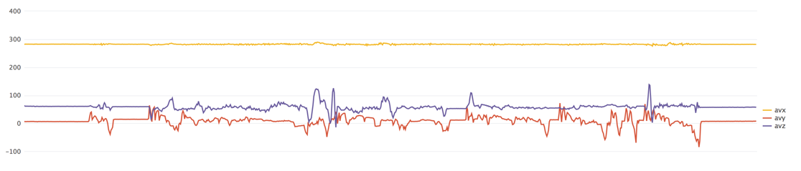
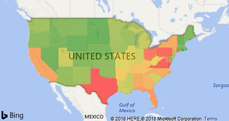

---

title: Embedded analytics with Power BI custom visuals
description: Use rich data visuals for hot data as well as warm data to gain actionable insights.
author: MargoC
manager: AnnBe
ms.date: 5/14/2018
ms.assetid: c2dde225-ee8a-47fd-9b31-b4eb34a0a861
ms.topic: article
ms.prod: 
ms.service: business-applications
ms.technology: 
ms.author: margoc
audience: Admin

---
#  Embedded analytics with Power BI custom visuals 

[!include[banner](../../../../includes/banner.md)]

Use rich data visuals for hot data as well as warm data to gain actionable
insights.

-   Monitor the pulse chart for device connection state (online or offline).

<!-- picture -->

-   Monitor a heat map view of alerts and devices with the capability to drill
    into alert details directly and further drill into the broken rules behind
    the alerts.

<!-- picture -->

