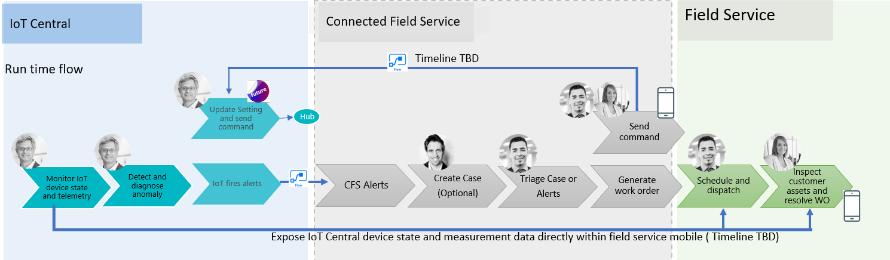

---

title: Enhanced IoT Central integration
description: For the first phase of integration, the focus of the integration solution will be through Flow.
author: MargoC
manager: AnnBe
ms.date: 5/14/2018
ms.assetid: ce0f2e97-8ded-4530-9c50-fc82ce4a6171
ms.topic: article
ms.prod: 
ms.service: business-applications
ms.technology: 
ms.author: margoc
audience: Admin

---
#  Enhanced IoT Central integration

[!include[banner](../../../../includes/banner.md)]

For the first phase of integration, the focus of the integration solution will
be through Flow. This is a one-way communication from IoT Central to Connected
Field Service. With IoT Central monitoring remote devices, any measurements that
exceed thresholds defined in IoT Central will trigger an action to fire an alert
in CFS. Field service managers can group these alerts by criteria such as
customer asset and incident type.

<!-- picture -->

For the Fall release, technicians can be equipped with and act on insight from
IoT devices when on site, with a few options depending on the state of IoT
Central.

-   Embed IoT Central device state and measurement visuals directly within the
    Field Service mobile application.

-   Store telemetry data from IoT Central in an Azure blob and enable an
    embedded Power BI visualizing the data.

-   Allow technicians to send commands from the Field Service mobile application
    back to IoT Central.
