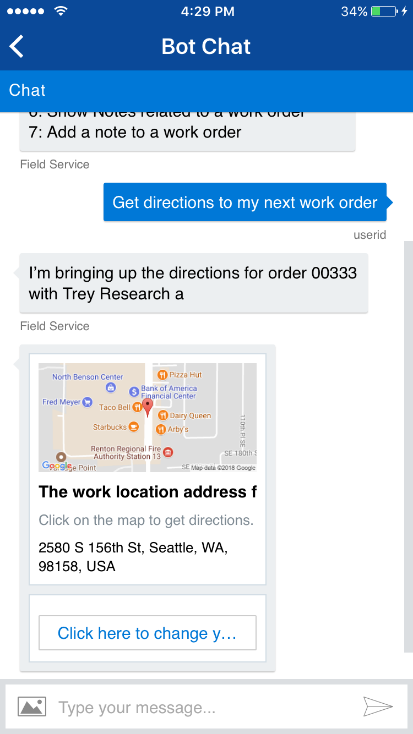

---

title: Microsoft Bot Framework Integration
description: Microsoft Bot Framework Integration
author: MargoC
manager: AnnBe
ms.date: 5/14/2018
ms.assetid: f98775be-f51b-4aaa-86ba-bf14dfaf54d4
ms.topic: article
ms.prod: 
ms.service: business-applications
ms.technology: 
ms.author: margoc
audience: Admin

---
#  Microsoft Bot Framework Integration

[!include[banner](../../../../includes/banner.md)]

Most field service work involves a set of the same steps that are repeated on
any given job: update the status of a work order to traveling, open the
directions for a work order, view the service tasks for a work order, and so on.
These tasks can be streamlined through conversational and even hands-free
experiences as opposed to requiring technicians to click through a mobile
application. We now provide the ability to surface a bot developed with the
Microsoft Bot Framework in our mobile app as well as template bot code
interfacing with Dynamics to get your own bots up and running quickly that can
be used by technicians to get their work done faster. We handle the
authentication of your bot to your Dynamics 365 CE organization so that there is
no need to have the user authenticate twice.

<!-- picture -->
 IMAGELINKSTART media/image29.png
IMAGELINKEND
