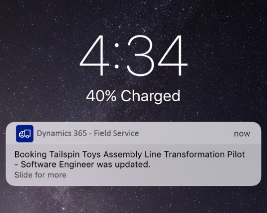

---

title: Push Notifications
description: Push Notifications
author: MargoC
manager: AnnBe
ms.date: 5/14/2018
ms.assetid: 6c2eb9e7-9bfe-4c4b-b338-6876669f06b8
ms.topic: article
ms.prod: 
ms.service: business-applications
ms.technology: 
ms.author: margoc
audience: Admin

---
#  Push Notifications

[!include[banner](../../../../includes/banner.md)]

Out of the box our mobile application now allows field service technicians to
receive push notifications any time that they are assigned a booking, one of
their bookings has been changed, or when they have arrived on-site for a work
order (provided location is being shared). When and how push notifications are
triggered is entirely configurable and can be customized for any use case. Push
notification reminders can improve the timeliness of technicians and accuracy of
logging.

<!-- picture -->
 IMAGELINKSTART media/image27.png
IMAGELINKEND
