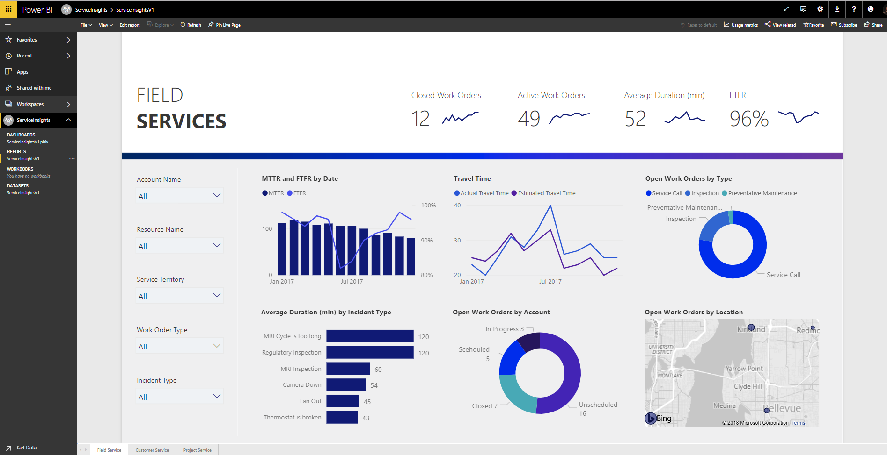

---

title: Power BI Insights App for Field Service
description: Power BI Insights App for Field Service
author: MargoC
manager: AnnBe
ms.date: 5/14/2018
ms.assetid: a1628466-2c6f-46ed-a77b-e8699f368c47
ms.topic: article
ms.prod: 
ms.service: business-applications
ms.technology: 
ms.author: margoc
audience: Admin

---
#  Power BI Insights App for Field Service 

[!include[banner](../../../includes/banner.md)]

With the new Power BI Insights app for Field Service built atop the Common Data
Service for Analytics, quickly review the state of your field service
organization by tracking critical KPIs provided OOB like the First Time Fix Rate
(FTFR) and Mean Time to Repair (MTTR) over time. Easily configure and customize
the app to your organization’s needs.

<!-- Picture 1 -->

Measure technician effectiveness by charting work orders based on completion on
the first visit and considering such dimensions as skills or work order types,
leading to actionable insights such as the need to improve knowledge article
access or training to mitigate skills gaps amongst technicians.
