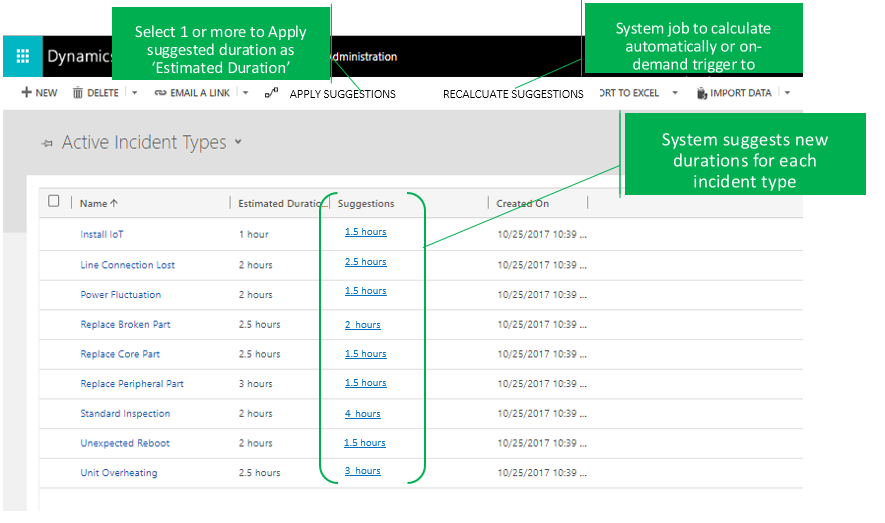

---

title: Suggested Duration for Incident Type
description: A resource might not able to complete a task as originally estimated due to low skill proficiency or due to some other exception during the day, in turn negatively impacting the ability to meet SLAs and the demands of customers.
author: MargoC
manager: AnnBe
ms.date: 5/14/2018
ms.assetid: cc93f7da-0690-4975-8816-4c47ab3b52d8
ms.topic: article
ms.prod: 
ms.service: business-applications
ms.technology: 
ms.author: margoc
audience: Admin

---
#  Suggested Duration for Incident Type

[!include[banner](../../../includes/banner.md)]

A resource might not able to complete a task as originally estimated due to low
skill proficiency or due to some other exception during the day, in turn
negatively impacting the ability to meet SLAs and the demands of customers. To
ensure accurate duration estimation, Field Service provides OOB the ability to
take historical data and other variables into consideration. For phase 1 (Fall
release), use a system job to keep refining Estimated Durations daily based on
the average of actual durations of historical booking data. For phase 2, you
will be able to make use of a machine learning model to predict the duration
distribution per incident type, considering service tasks and other variables.

>   
<!-- picture -->

