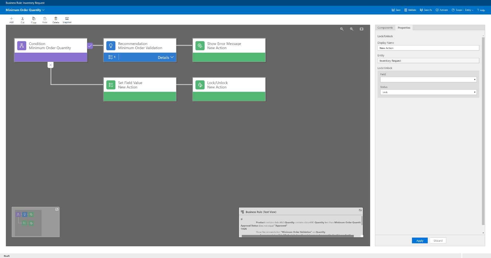

---

title: Server-side logic for validation
description: Business rules on Common Data Service for Apps entities make it possible to visually define server-side business logic for canvas and model‑driven apps.
author: MargoC
manager: AnnBe
ms.date: 4/27/2018
ms.topic: article
ms.prod: 
ms.service: business-applications
ms.technology: 
ms.author: margoc
audience: Admin

---
#  Server-side logic for validation

[!include[banner](../../../includes/banner.md)]

Business rules on Common Data Service for Apps entities make it possible to
visually define server-side business logic for canvas and model‑driven apps.

Use business rules to:

-   Set default values for form fields based on logical parameters.

-   Create simple and multi-step validation logic for any entity field, or for a
    combination of fields.

-   Trigger workflows and other processes directly from rule logic.

<!-- App_Plat_BusinessRules_W (1).png -->

*Business rules designer*

[For more information about the business rules designer, go to Create business
rules and recommendations to apply logic in a
form.](https://docs.microsoft.com/en-us/dynamics365/customer-engagement/customize/create-business-rules-recommendations-apply-logic-form)
