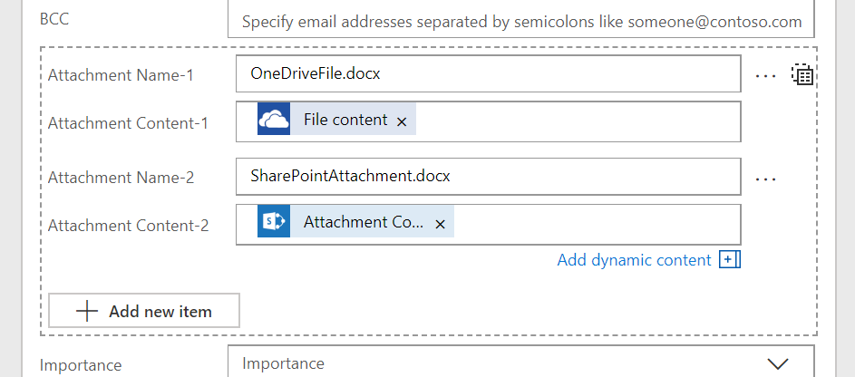

---

title: Add multiple records to array inputs
description: There are many actions in Flow that take an array as an input.
author: MargoC
manager: AnnBe
ms.date: 4/27/2018
ms.topic: article
ms.prod: 
ms.service: business-applications
ms.technology: 
ms.author: margoc
audience: Admin

---
#  Add multiple records to array inputs

[!include[banner](../../../includes/banner.md)]

There are many actions in Flow that take an array as an input. For example,
the **Send email** action has a list of Attachments** **that can be included
with the email. Before, you could either pass one attachment, or, you could
generate a list of attachments from the outputs of another action using
the **Select** action. However, there was no easy way to just
have *two* attachments.

So we're happy to announce today that, for any action that takes a list as an
input, you can add as many items inline that you wish.

<!-- Picture 5 -->

*Array inputs*

To add a second (or third, or fourth etc...) attachment, just click the **Add
new item** button below the main fields for that attachment. Each time you'll
get a new set of the fields for the new attachment (or any other record you are
adding). To remove an item, select the "..." menu next to the first field in the
record you want to delete.
