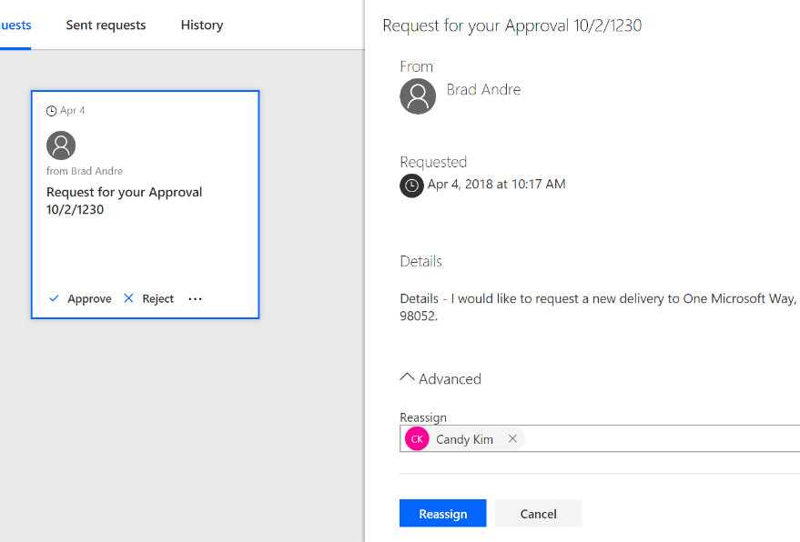

---

title: Approval reassignment
description: If you are unable or do not want to complete an approval yourself, you can now send the approvals you receive to another person.
author: MargoC
manager: AnnBe
ms.date: 4/27/2018
ms.topic: article
ms.prod: 
ms.service: business-applications
ms.technology: 
ms.author: margoc
audience: Admin

---
#  Approval reassignment

[!include[banner](../../../includes/banner.md)]

If you are unable or do not want to complete an approval yourself, you can now
send the approvals you receive to another person. First, click on the approval
in the Approval center, and then select Advanced in the approval pane. You will
get an input field where you can provide the email of the user you want to
handle the user on your behalf. Once you reassign the approval, that user will
see the approval request in their Approval center.

<!-- Picture 1 -->

*Reassign approvals*

You can also reassign from the "..." menu on each Approval in your received
requests.
