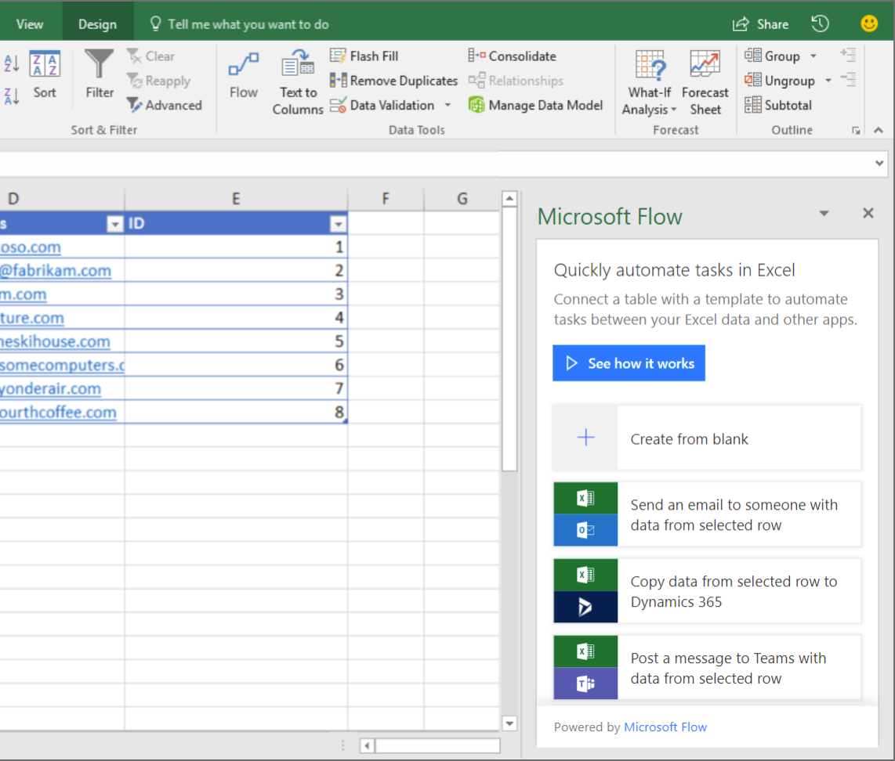

---

title: Build and run flows from Excel
description: With the new Flow button, create and trigger automations from Flow on your table data in Excel to automate data processing or the copying/importing of data.
author: MargoC
manager: AnnBe
ms.date: 4/27/2018
ms.topic: article
ms.prod: 
ms.service: business-applications
ms.technology: 
ms.author: margoc
audience: Admin

---
#  Build and run flows from Excel

[!include[banner](../../../includes/banner.md)]

With the new Flow button, create and trigger automations from Flow on your table
data in Excel to automate data processing or the copying/importing of data. You
can create and run on-demand flows for selected rows in any Excel table on
spreadsheets hosted in SharePoint or OneDrive for Business.

To get started, in Excel, select the Flow button on the Data tab. From the Flow
launch panel, build your flow by using the For a selected row trigger, or start
from one of the templates:

-   For a selected row -\> send email

-   For a selected row -\> create an entity in Dynamics

-   For a selected row -\> send for approval

-   For a selected row -\> post a message to Teams

-   For a selected row -\> create a row in another spreadsheet

-   For a selected row -\> Post a message to Twitter

After the flow is created, select a row, and then select the Play button to see
your flow in action.

<!-- Picture 2 -->

*Create a new on-demand flow in Excel*
