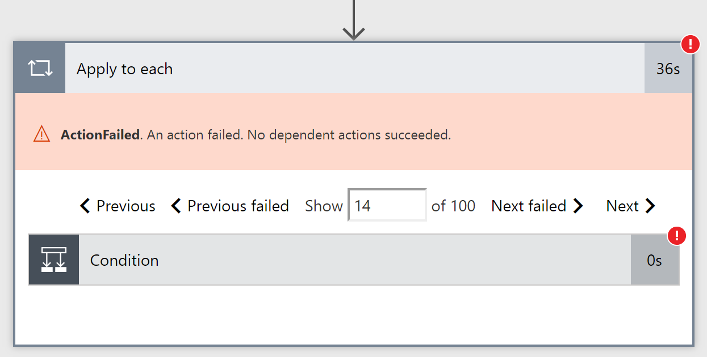

---

title: Find errors in apply to each
description: We recently increased the limits for Apply to each, which means you can have loops that contain thousands of items.
author: MargoC
manager: AnnBe
ms.date: 4/27/2018
ms.topic: article
ms.prod: 
ms.service: business-applications
ms.technology: 
ms.author: margoc
audience: Admin

---
#  Find errors in apply to each

[!include[banner](../../../includes/banner.md)]

We recently increased the limits for Apply to each, which means you can have
loops that contain thousands of items. However, if a small number of the actions
in these loops fail, it's important that you can jump directly to the failure.
This week we are adding new functionality: in the run view, there are two new
buttons to jump you directly to the Next and Previous *Failed* items. Now, you
can quickly go through only the failures in your actions to identify what went
wrong -- even if there are thousands of items in the loop.

*Errors in Apply to each*
