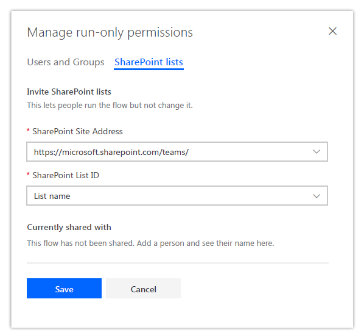

---

title: To add a list or library as a run-only user
description: Run-only users can only be added to manually invoked flows—for example, flows that use the For a selected item trigger.
author: MargoC
manager: AnnBe
ms.date: 4/27/2018
ms.topic: article
ms.prod: 
ms.service: business-applications
ms.technology: 
ms.author: margoc
audience: Admin

---
#  To add a list or library as a run-only user 

[!include[banner](../../../../includes/banner.md)]

Run-only users can only be added to manually invoked flows—for example, flows
that use the For a selected item trigger.

To add a list or library as a run-only user:

1.  Select the flow in the **My flows** or **Teams flows** list.

2.  On the flow details page, select the **Add another user** button in the
    **Manager run-only users** section.

3.  Go to the **SharePoint** tab.

4.  Select the site address and list ID of the list you want to share the flow
    with, and then select **Share**.

<!-- Picture 24 -->

*Share a flow with run-only permissions*

After a flow is a shared with run-only permissions, all members of that list
will be able to invoke the flow from the Flow menu in that list or library.
