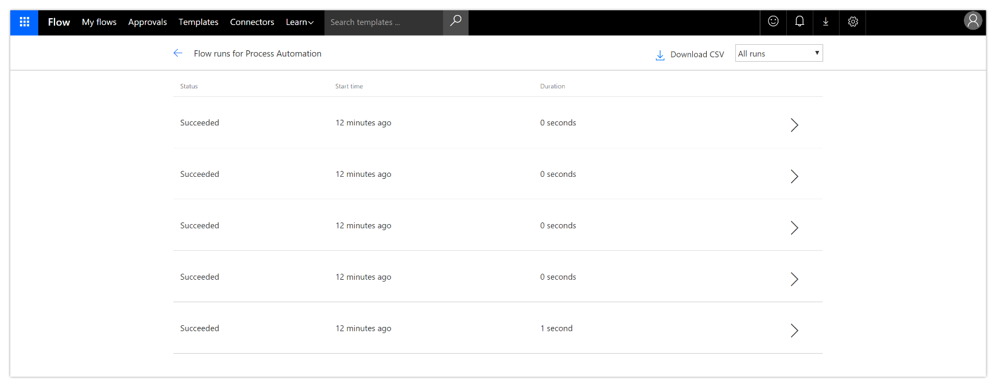
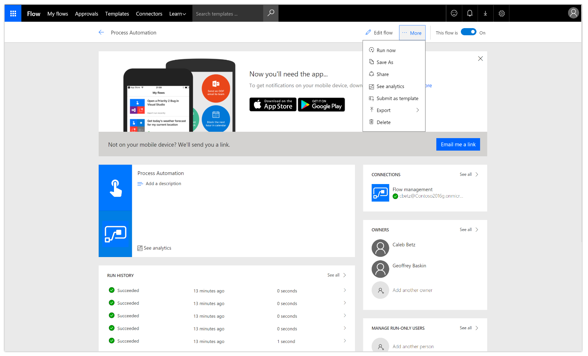
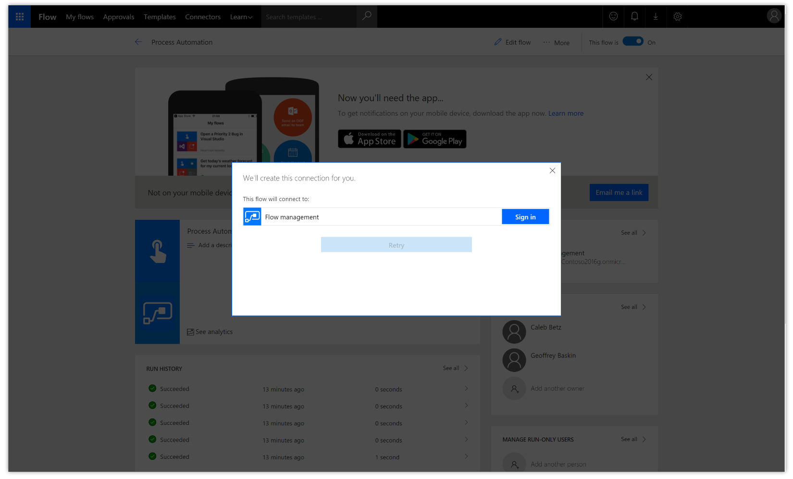

---

title: GDPR compliance
description: Microsoft is committed to GDPR compliance across our cloud services, including Microsoft Flow.
author: MargoC
manager: AnnBe
ms.date: 4/27/2018
ms.topic: article
ms.prod: 
ms.service: business-applications
ms.technology: 
ms.author: margoc
audience: Admin

---
#  GDPR compliance

[!include[banner](../../../includes/banner.md)]

Microsoft is committed to GDPR compliance across our cloud services, including
Microsoft Flow. When a user is deleted from Azure Active Directory, the tenant
administrator receives an email notification indicating that the user has been
deleted from the corporate directory. The admin can determine which flows the
user owned by executing a PowerShell script, and can then reassign ownership in
the Flow Admin Center.

<!-- Picture 31 -->

*Modify ownership in the Admin Center*

Newly assigned owners can view or export the run details for the flow.

<!-- Picture 32 -->

*Run details*

Flow owners can also do a Save As operation to provide a new name.

<!-- Picture 33 -->

*Save As*

During this process, connections need to be reestablished to make the flow
operational again.

<!-- Picture 34 -->

*Connections*
