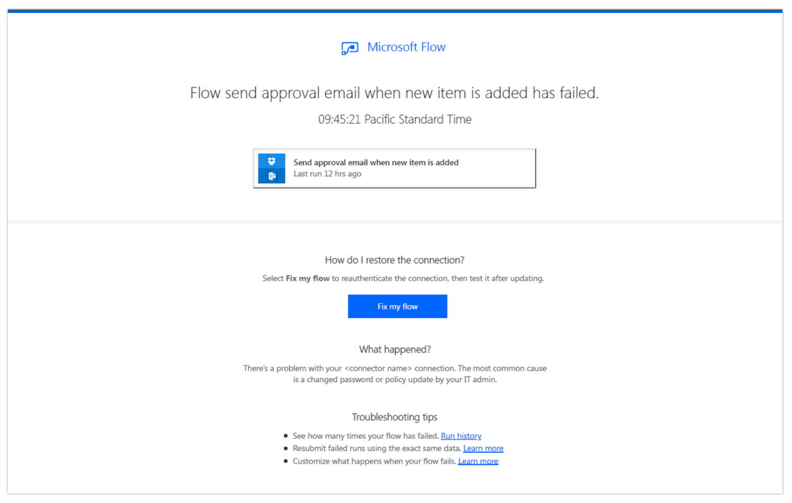

---

title: Repair recommendations sent in email for failed flows
description: Enable email notifications to detect flow failures.
author: MargoC
manager: AnnBe
ms.date: 4/27/2018
ms.topic: article
ms.prod: 
ms.service: business-applications
ms.technology: 
ms.author: margoc
audience: Admin

---
#  Repair recommendations sent in email for failed flows

[!include[banner](../../../includes/banner.md)]

Enable email notifications to detect flow failures. To enable this feature, go
to the Flow details page, and then, on the contextual menu (…), subscribe to
receiving emails about flow failures.

These useful email notifications provide:

-   Information about why your flow failed.

-   Meaningful remediation steps.

-   Additional resources to help you build robust flows that never fail.

<!-- Picture 20 -->

*Flow repair email*

If you don’t want to receive emails but want to read about remediation steps and
related resources, access them from the Run History view in the Flow portal.
