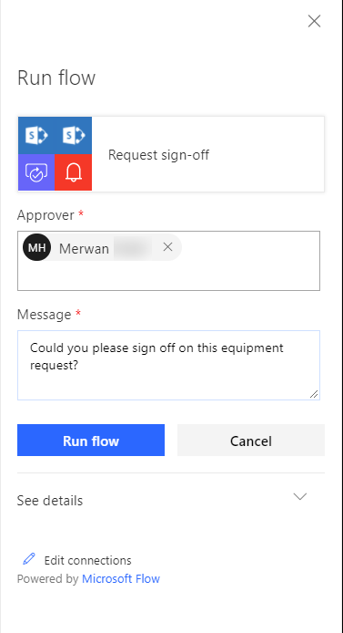
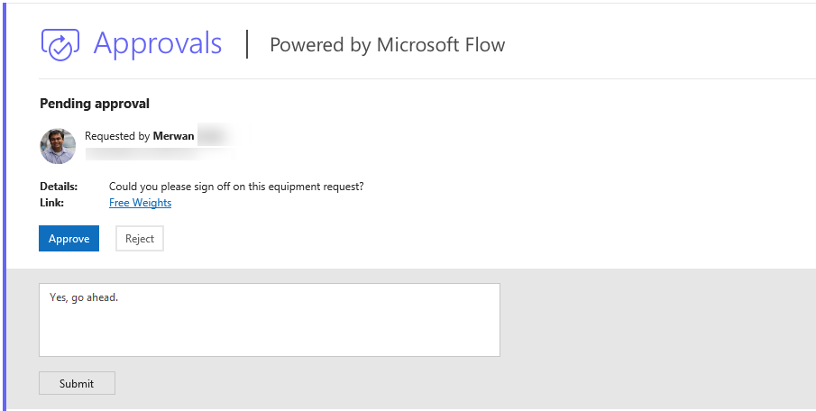
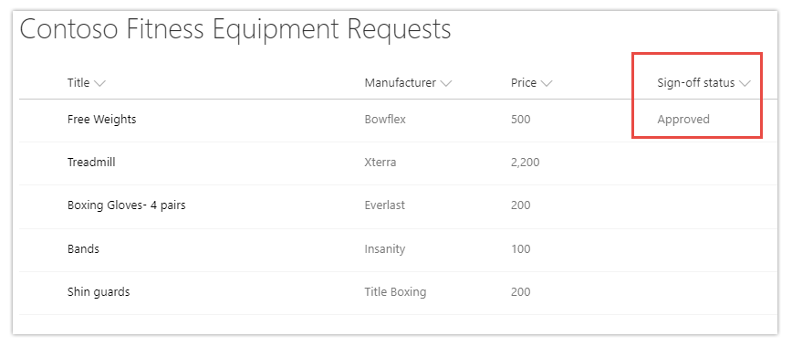

---

title: Request for sign-off flow built into SharePoint
description: Use the Request sign-off feature in SharePoint to quickly send an item for approval to someone in your organization (no setup required).
author: MargoC
manager: AnnBe
ms.date: 4/27/2018
ms.topic: article
ms.prod: 
ms.service: business-applications
ms.technology: 
ms.author: margoc
audience: Admin

---
#  Request for sign-off flow built into SharePoint

[!include[banner](../../../includes/banner.md)]

Use the Request sign-off feature in SharePoint to quickly send an item for
approval to someone in your organization (no setup required).

Request sign-off makes use of SharePoint's integration with Flow. Just select a
file or list item (not a folder) in SharePoint, access the Flow menu in the
modern library UI, and then select Request sign-off. This flow will appear
alongside any other custom flows added to the library.

<!-- Picture 21 -->

*Request sign-off from the Flow menu in SharePoint*

When invoked, Request sign-off creates a new text column in your library, called
Sign-off status. This column records the state of your request. It works just
like any other text column—sort, filter, or group by it to organize your
library.

On invocation, you’re also notified that an approval request will be sent on
your behalf, and asked to provide consent. After providing consent, pick one or
more approvers, and then write a message for your approval request. If you add
more than one approver, any one of them can approve your request.

<!-- Picture 1 -->

*Pick one or more approvers and enter a message*

When you select the Run flow button, your request is sent, and the Sign-off
status column shows Pending.

The person you send the approval to will receive an approval request. This is an
actionable message on clients that support it. For example, an Outlook user can
approve the request directly from Outlook. The approver can also provide
comments along with their decision and can click a link to view the item in
question.

<!-- AppPlat_Request_Sign_Off_3.png -->

*Actionable message*

The Sign-off status column is then updated with the decision, and the person who
sent the approval request receives an email with the comments.

<!-- Picture 23 -->

*Sign-off status is updated with the decision*
