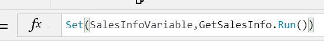

---

title: Step Three
description: The last step is to add your flow to the PowerApp in the formula bar.
author: MargoC
manager: AnnBe
ms.date: 4/27/2018
ms.topic: article
ms.prod: 
ms.service: business-applications
ms.technology: 
ms.author: margoc
audience: Admin

---
#  Step Three

[!include[banner](../../../../includes/banner.md)]

The last step is to add your flow to the PowerApp in the formula bar. Select the
control to run your flow from, and on the **Action** tab on the ribbon,
select **Flow**. Select the flow you created to add it to the formula bar and
pass any parameters the flow requires.

<!-- Picture 42 -->

*Set Variable*

We recommend that you use **Set()** or **UpdateContext()** to set a variable
that stores the result of your flow. This way if you have multiple values
returned from the flow, you can access different properties in various places in
your app. For example, the above flow has two properties it
returns, **most_sales** and **sellers**, and you can use either on a control:

<!-- Picture 43 -->

*View result properties*

Today, you can return basic types like Text or Email. However, there may be
cases where you want to return a list of data to the PowerApp, for example a
list of names. In this case, you can use the **Join** action inside of your
flow, and then use the **Split** function in your PowerApp.

<!-- Picture 44 -->

*Use results in gallery*

In the example, notice how the result of the flow is set in the
SalesInfoVariable, and then the gallery is bound to the table output by
splitting the names on a comma. If you have an array of objects in the flow, use
the **Select** action first, to choose the property you want to pass to the
PowerApp before joining the array.
