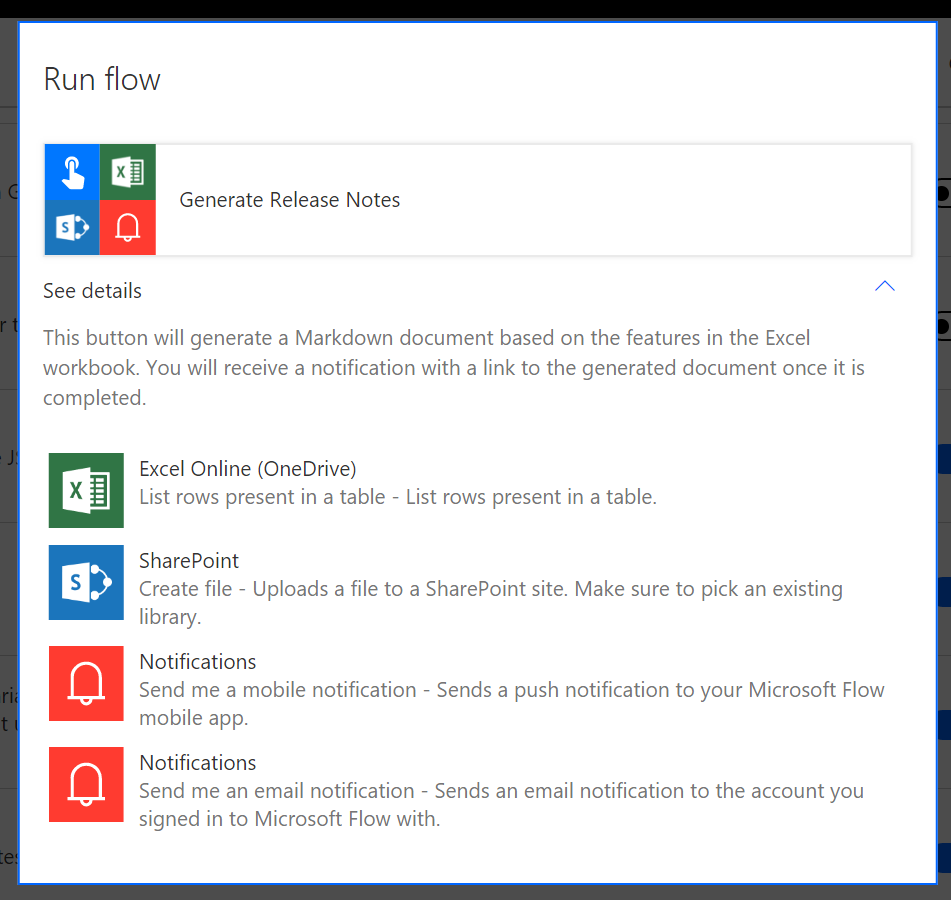

---

title: See details of a flow
description: When you run a flow that has been shared with you, you can see details of exactly what that flow is going to do with your connections.
author: MargoC
manager: AnnBe
ms.date: 4/27/2018
ms.topic: article
ms.prod: 
ms.service: business-applications
ms.technology: 
ms.author: margoc
audience: Admin

---
#  See details of a flow 

[!include[banner](../../../includes/banner.md)]

When you run a flow that has been shared with you, you can see details of
exactly what that flow is going to do with your connections. Whenever you run a
flow, select **See details**, and you'll be presented with a list of every
action that flows uses (both name and description). Since the flow can use your
accounts or connections, you should only ever run a flow if you trust the owner
of the flow, and, are comfortable with them taking the actions listed
under **See details**. 

<!-- Picture 3 -->

*See details*
