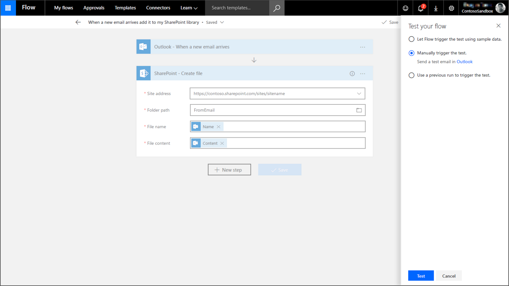

---

title: Test your flow by using sample data
description: Test your flows after creating them to ensure that they work as you expect.
author: MargoC
manager: AnnBe
ms.date: 4/27/2018
ms.topic: article
ms.prod: 
ms.service: business-applications
ms.technology: 
ms.author: margoc
audience: Admin

---
#  Test your flow by using sample data

[!include[banner](../../../includes/banner.md)]

Test your flows after creating them to ensure that they work as you expect.

There are two ways to access the test flow:

-   Go to the flow details page, select the contextual menu (…), and then select
    Test Flow.

\-or-

-   Select the Test button in the banner after saving your flow.

In the Test pane, there are three modes for testing your flow:

-   Let Flow trigger the test by using sample data.

-   Manually trigger the test yourself by doing the action that triggers the
    flow.

-   Use data from previous runs to perform the test.

<!-- IMAGE_AppPlat_FlowsTest_AA.png -->

*Testing flow side panel*

Note, however, that not all options are available for all types of triggers.
