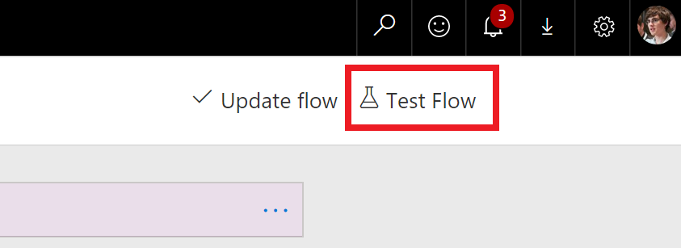

---

title: Test flows with previous run data
description: When you are editing a flow that you have run in the past, it can be useful to be able to re-run the flow with the trigger data from a previous run.
author: MargoC
manager: AnnBe
ms.date: 4/27/2018
ms.topic: article
ms.prod: 
ms.service: business-applications
ms.technology: 
ms.author: margoc
audience: Admin

---
#  Test flows with previous run data

[!include[banner](../../../includes/banner.md)]

When you are editing a flow that you have run in the past, it can be useful to
be able to re-run the flow with the trigger data from a previous run. This gives
you a way to verify that your flow now behaves as you expect. This has been
possible before by going to the **Run history** view and selecting **Resubmit**.
Now, to streamline the editing experience, we are adding a **Test flow** button
directly in the designer.

<!-- Picture 1 -->

*Test flow button*

When you select Test flow, you will see a new pane with two options:

1.  **Perform the trigger action yourself.** The action depends on what the
    trigger is - for example, for a button trigger you'll run the flow button,
    for an email trigger you'll send yourself an email, or for a file trigger
    you'll upload a file to SharePoint online.

2.  **Use data from previous runs.** Here, if your flow has run before, you'll
    get a list of the most recent runs and be able to pick one to test your flow
    with.

<!-- Picture 2 -->

*Test flow pane*

Once you run the flow you'll immediately see the details of the flow running and
be able to watch each of the steps execute. Finally, runs started via this route
are marked as Tests in the run history view so you can tell them apart from flow
runs that were triggered normally.
