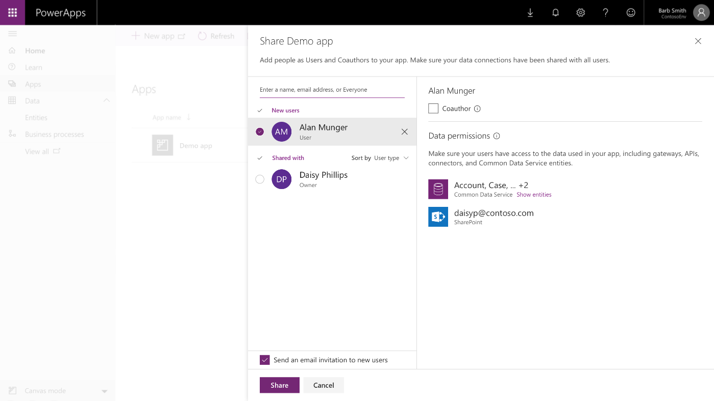

---

title: Improved app sharing experience
description: Canvas apps.
author: MargoC
manager: AnnBe
ms.date: 4/27/2018
ms.topic: article
ms.prod: 
ms.service: business-applications
ms.technology: 
ms.author: margoc
audience: Admin

---
#  Improved app sharing experience 

[!include[banner](../../../includes/banner.md)]

**Canvas apps.** With the improved app sharing experience for canvas apps, you
can quickly view the list of data sources used by an app and set up user
permissions to access that data. For example, if an app connects to a SharePoint
list and the Common Data Service for Apps, you’ll see the data sources listed in
the Data permissions section. For the Common Data Service for Apps, you’ll see a
list of entities used by the app. You can then select quick permissions to apply
to these entities, such as Read only, Read and write, or Full access. If the
quick permissions don't meet your needs, assign custom permissions through
security roles.

<!-- picture -->

*Share an app: Data sources and permissions*

**Model-driven apps.** Share model-‑driven apps with users by assigning
appropriate security roles that provide access to the entities and data in the
Common Data Service for Apps.

<!-- AppSharing - Screenshot 3.png -->

*Share a model-‑driven app with security roles*
