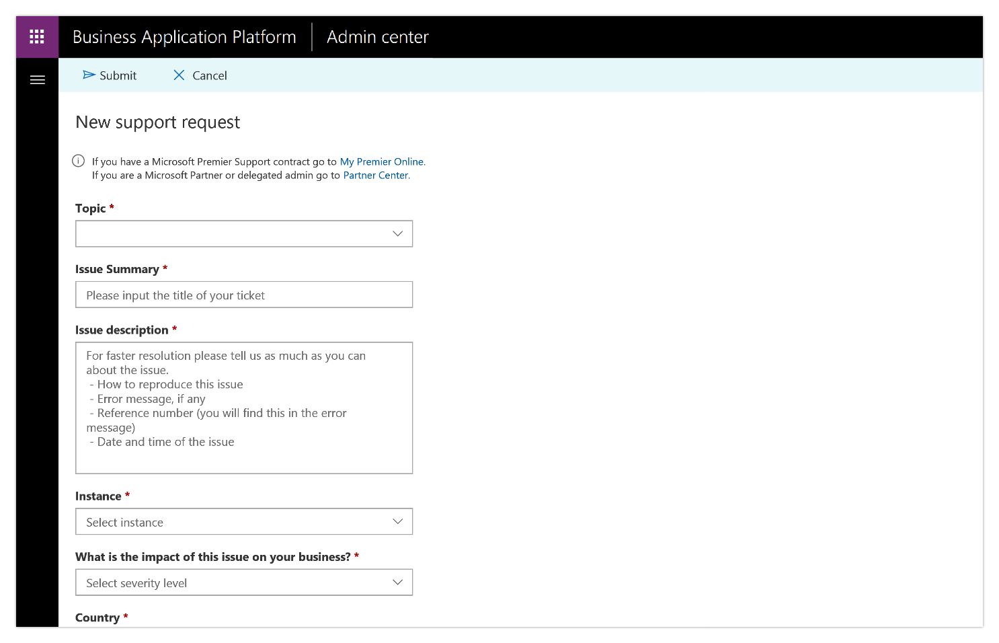

---

title: Improved support ticketing for admins
description: The new Business Application Platform Admin center includes a support ticketing experience that admins can use to easily contact a Microsoft support representative if they are blocked.
author: MargoC
manager: AnnBe
ms.date: 4/27/2018
ms.topic: article
ms.prod: 
ms.service: business-applications
ms.technology: 
ms.author: margoc
audience: Admin

---
#  Improved support ticketing for admins

[!include[banner](../../../includes/banner.md)]

The new Business Application Platform Admin center includes a support ticketing
experience that admins can use to easily contact a Microsoft support
representative if they are blocked.

**Note:** The Business Application Platform Admin center also includes the
existing capabilities of the current PowerApps admin center, including the
ability to establish data loss prevention policies, manage environments, and
monitor active PowerApps and Flow users within an organization.

To try out the new support experience:

1.  Go to the [Business Application Platform Admin
    center](https://go.microsoft.com/fwlink/?linkid=869111), and select **Help +
    support** on the left navigation bar.

2.  Select **New support request**, fill out the details for your issue, attach
    any relevant screenshots, and select **Submit**.

<!-- Picture 10 -->

New support request form

