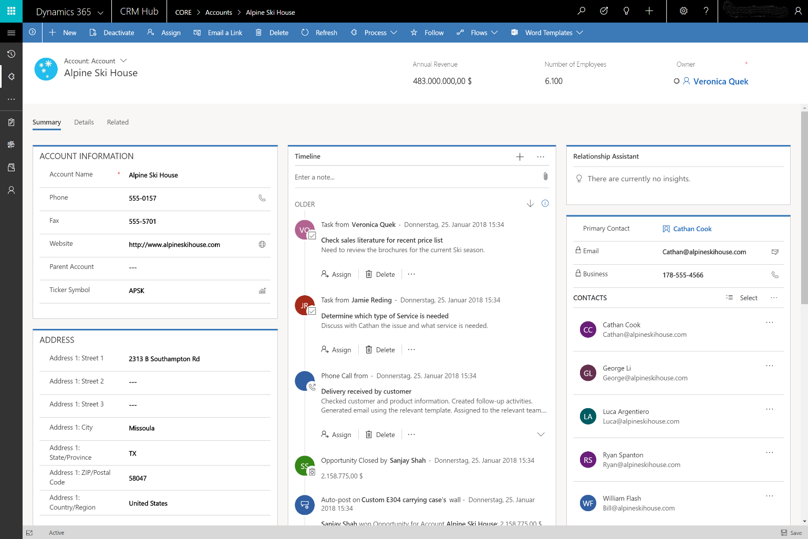

---

title: Metadata-driven responsive user experiences
description: Model-driven apps are responsive across different form factors and devices, allowing users to quickly continue their work while on the go.
author: MargoC
manager: AnnBe
ms.date: 4/27/2018
ms.topic: article
ms.prod: 
ms.service: business-applications
ms.technology: 
ms.author: margoc
audience: Admin

---
#  Metadata-driven responsive user experiences

[!include[banner](../../../../includes/banner.md)]

Model-driven apps are responsive across different form factors and devices,
allowing users to quickly continue their work while on the go. 

Responsive user experiences allow for:

-   A single layout for forms, dashboards, and lists that automatically reflows.

-   Navigation and grids that adapt to mobile devices to enable efficient touch
    interactions.

-   Visual controls that are optimized for touch and provide engaging user
    experiences. Examples include Slider, Arc, and Calendar controls.

<!-- App_Plat_ResponseAcct_G.PNG -->

*Account form on a desktop computer*

<!-- Picture 4 -->

*Account form on a phone*
