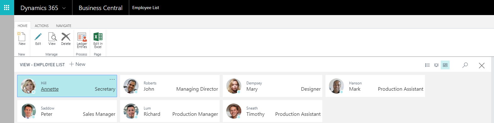

---

title: Human resources
description: Employees Group and track employee information, and organize employee data according to different types of information, such as experience, skills, education, training, and union membership.
author: MargoC
manager: AnnBe
ms.date: 4/27/2018
ms.topic: article
ms.prod: 
ms.service: business-applications
ms.technology: 
ms.author: margoc
audience: Admin

---
#  Human resources

[!include[banner](../../../includes/banner.md)]

**Employees**

Group and track employee information, and organize employee data according to
different types of information, such as experience, skills, education, training,
and union membership.

**Expense management**

Post expenses against employee cards to track and reimburse their expenses.

<!-- SMB_BusinessCentral_EmployeeList_A.png -->

*Example of a Business Central employee list*
