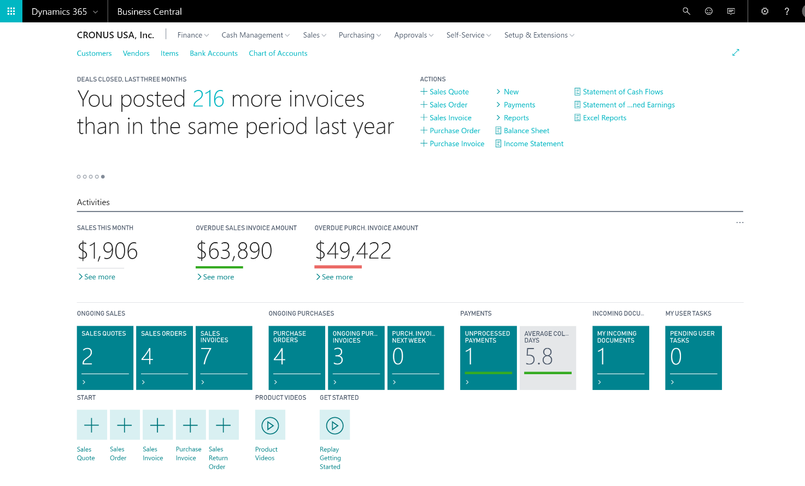

---

title: Modern user experience
description: With the Spring ’18 release, Dynamics 365 Business Central offers a refreshed and modern user experience, optimized for insights and productivity.
author: MargoC
manager: AnnBe
ms.date: 4/27/2018
ms.topic: article
ms.prod: 
ms.service: business-applications
ms.technology: 
ms.author: margoc
audience: Admin

---
#  Modern user experience

[!include[banner](../../../includes/banner.md)]

With the Spring ’18 release, Dynamics 365 Business Central offers a refreshed
and modern user experience, optimized for insights and productivity.

<!-- SMB_BusinessCentral_ModenaRoleCenter_A.png -->

*Example of a refreshed interface in Business Central*
