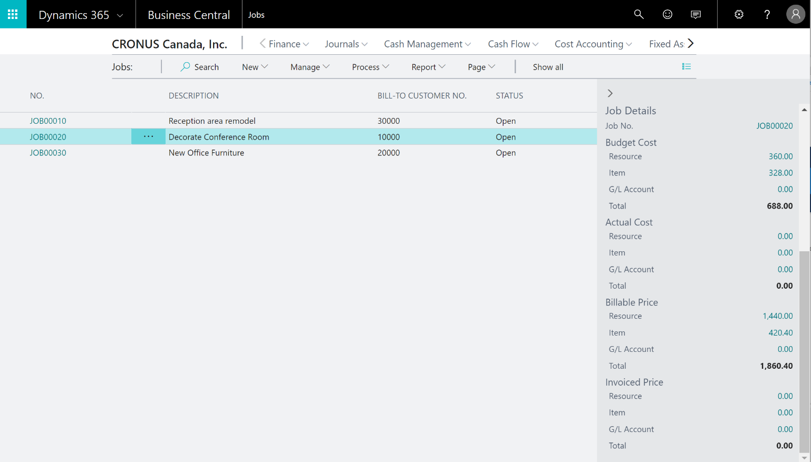

---

title: Project management
description: Register and sell resources, combine related resources into one resource group, or track individual resources.
author: MargoC
manager: AnnBe
ms.date: 4/27/2018
ms.topic: article
ms.prod: 
ms.service: business-applications
ms.technology: 
ms.author: margoc
audience: Admin

---
#  Project management

[!include[banner](../../../includes/banner.md)]

**Resources**

Register and sell resources, combine related resources into one resource group,
or track individual resources.

**Estimates**

Monitor resource usage, and get a complete overview of your capacity for each
resource, with information about availability and planned costs on orders and
quotations.

**Jobs**

Keep track of usage on jobs and data for invoicing the customer. Manage both
fixed-price jobs and time-and-materials jobs.

**Time sheets**

Time sheets are a simple and flexible solution for time registration with
manager approval, and they integrate with Service, Jobs, and Basic Resources.

<!-- SMB_BusinessCentral_Projects_A.png -->

*Example of a Business Central project list*
