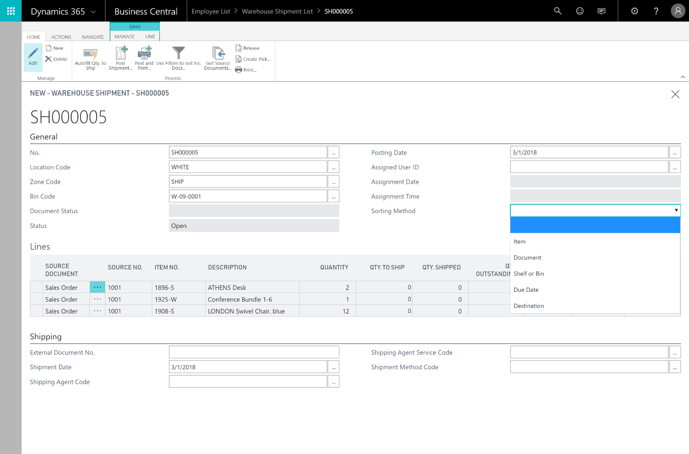

---

title: Supply chain management
description: Manage sales orders, blanket sales orders, and sales order processes.
author: MargoC
manager: AnnBe
ms.date: 4/27/2018
ms.topic: article
ms.prod: 
ms.service: business-applications
ms.technology: 
ms.author: margoc
audience: Admin

---
#  Supply chain management

[!include[banner](../../../includes/banner.md)]

**Sales order management**

Manage sales orders, blanket sales orders, and sales order processes.

**Basic receivables**

Post sales transactions in journals and manage receivables. Register customers
and manage receivables by using general journals.

**Purchase order management**

Manage purchases, blanket orders, and purchase order processes.

**Locations**

Manage inventory in multiple locations that might represent a production plant,
distribution center, warehouse, showroom, retail outlet, or service car.

**Item transfers**

Track inventory as it’s moved from one location to another, and account for the
value of inventory in transit at various locations.

**Basic warehousing**

Manage items on a bin level. Pick and put away items in a bin, and move items
between bins by using a report that optimizes space usage and picking processes.

<!-- SMB_BusinessCentral_WarehouseShipment_A.png -->

*Example of a new warehouse shipment in Business Central*
