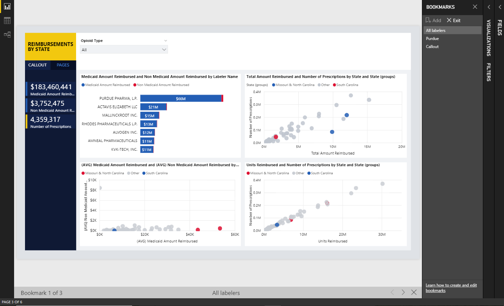

---

title: Bookmarking
description: Create bookmarks in the Power BI Service without first creating a bookmark in Power BI Desktop.
author: MargoC
manager: AnnBe
ms.date: 4/27/2018
ms.topic: article
ms.prod: 
ms.service: business-applications
ms.technology: 
ms.author: margoc
audience: Admin

---
#  Bookmarking

[!include[banner](../../../includes/banner.md)]

Create bookmarks in the Power BI Service without first creating a bookmark in
Power BI Desktop. The Bookmarking feature is generally available, and it no
longer requires the feature to be turned on from the **Preview** tab in the
**Options** dialog box.

<!-- picture -->

*Example of bookmarks*
