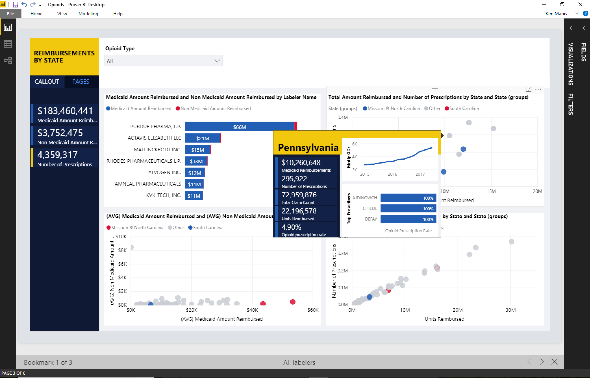

---

title: Canvas tooltips (Public Preview)
description: Using Canvas tooltips, you can design a report page as a custom tooltip for other visuals in a report.
author: MargoC
manager: AnnBe
ms.date: 4/27/2018
ms.topic: article
ms.prod: 
ms.service: business-applications
ms.technology: 
ms.author: margoc
audience: Admin

---
#  Canvas tooltips (Public Preview)

[!include[banner](../../../includes/banner.md)]

Using Canvas tooltips, you can design a report page as a custom tooltip for
other visuals in a report. You can design any type of custom tooltips you need,
from using cards that show detailed information to miniature drill-through pages
shown on mouse hover.

*Customizable canvas tooltips*
