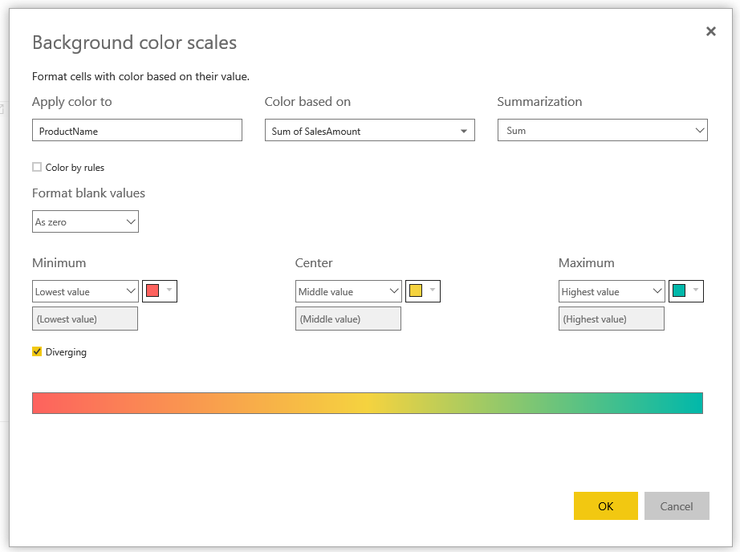

---

title: Conditional formatting based on another column
description: The table and matrix visuals in Power BI will now support conditional formatting based on another column, even if that column isn’t being used in the visual itself.
author: MargoC
manager: AnnBe
ms.date: 4/27/2018
ms.topic: article
ms.prod: 
ms.service: business-applications
ms.technology: 
ms.author: margoc
audience: Admin

---
#  Conditional formatting based on another column

[!include[banner](../../../includes/banner.md)]

The table and matrix visuals in Power BI will now support conditional formatting
based on another column, even if that column isn’t being used in the visual
itself. This will allow more flexibility with conditional formatting and even
allow you to write measures for deeper control over the formatting.

<!-- Picture 1 -->

